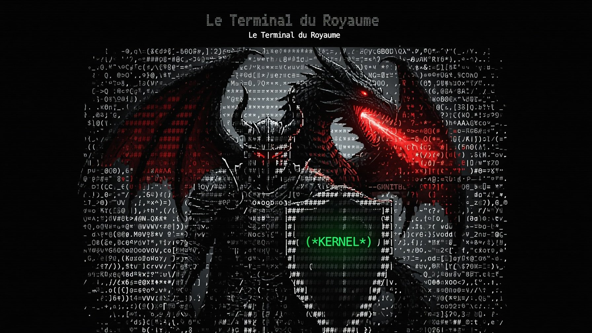
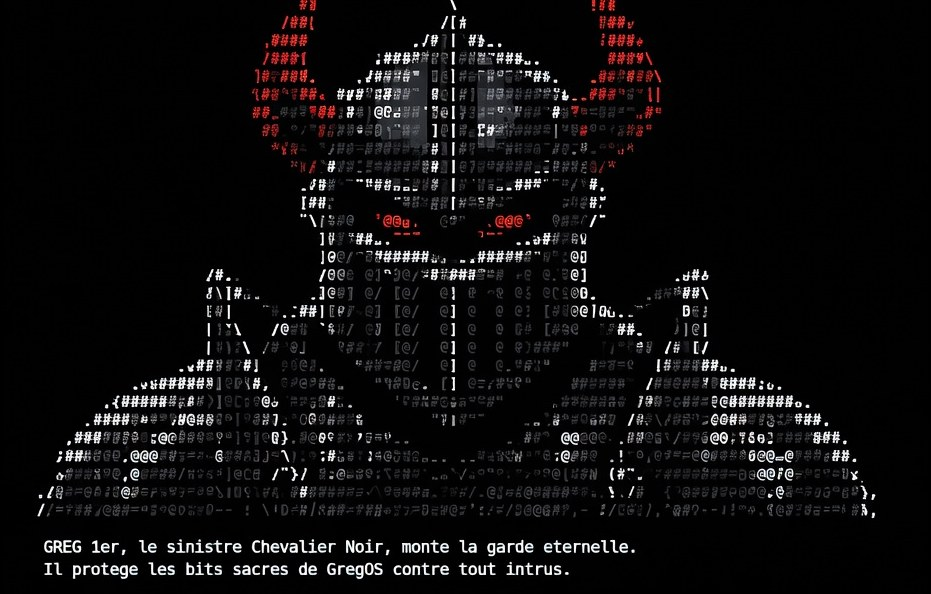
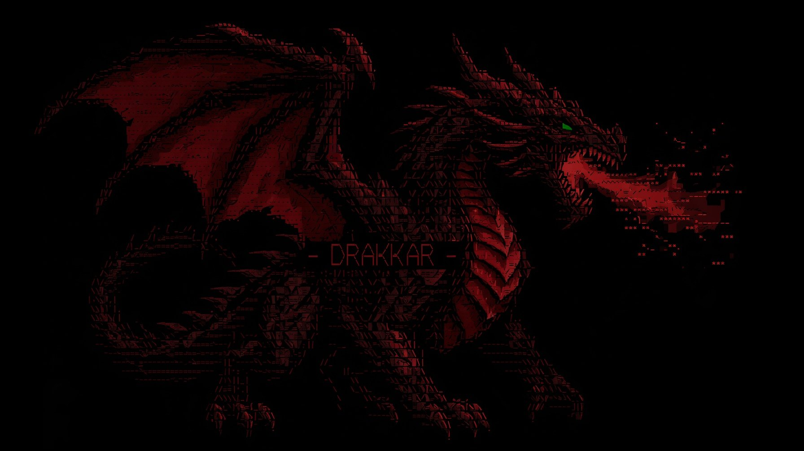

<div align="center">

# ⚔️ GregOS 🐉

### Le Terminal du Royaume

*Un système d'exploitation x86 32 bits écrit intégralement **from scratch** en C, C++ et assembleur —*
*où **GREG 1ᵉʳ, le Chevalier Noir**, et son dragon **DRAKKAR** veillent sur chaque cycle d'horloge.*




<br>

<table>
<tr>
<td align="center" width="50%">
<br>
<b>⚔️ GREG 1ᵉʳ — le Chevalier Noir</b><br>
<sub>Heaume de crâne, yeux de sang. Il monte la garde éternelle sur les bits sacrés du noyau.</sub>
</td>
<td align="center" width="50%">
<br>
<b>🐉 DRAKKAR — le dragon rouge</b><br>
<sub>Écailles de sang, œil de phosphore vert. Son feu couve dans chaque cycle d'horloge.</sub>
</td>
</tr>
</table>

</div>

---

## ✨ En un coup d'œil

|   |   |
|---|---|
| 🖥️ **Bureau graphique** | Compositeur + gestionnaire de fenêtres, curseur logiciel, **20 applications** natives |
| 🌐 **Vraie pile TCP/IP** | RTL8139 → ARP · IPv4 · ICMP · UDP · **TCP** · DNS · **HTTP** — `ping`, `nslookup`, `curl` marchent *vraiment* |
| 🧭 **GregNet** | Navigateur web fenêtré : barre d'adresse, historique, moteur de rendu HTML, liens cliquables |
| 💾 **Persistance disque** | Système de fichiers en mémoire sérialisé sur disque via un pilote **ATA/IDE** maison |
| 🎮 **Jeux + Casino** | **Le Donjon de Drakkar** (roguelike) · **Hnefatafl** (tafl viking vs IA minimax) · Démineur du Donjon · Snake, Tetris, Invaders, 2048… + Blackjack / Roulette / Slots / Poker en **GregCoins** |
| 🛡️ **Userland Ring-3** | CPL=3 réel, un *page directory* par processus, syscalls `INT 0x80`, chargeur **ELF** |
| ⚡ **ACPI + préemption** | Extinction / reboot ACPI réels, ordonnanceur préemptif 100 Hz, réseau piloté par IRQ |
| 🎨 **Shell 110+ cmds** | Pipes, alias, redirections, variables, historique, complétion Tab, thèmes ANSI |

> 🐉 **Refonte de l'UI :** direction **CRT phosphore × lore Greg & Drakkar** (noir + **rouge sang** + **vert phosphore**, or = métal du royaume). Deux gardiens en **ASCII-art plein écran, animés et menaçants** montent la garde : **DRAKKAR** — dragon de feu à l'œil vert — **se dresse pendant l'amorçage**, son brasier *vacille* et son œil *pulse* en temps réel ; puis **GREG 1ᵉʳ, le Chevalier Noir** *rougeoie comme du métal forgé* et **barre l'écran de connexion**. Brief : **[`UI_DESIGN_BRIEF.md`](UI_DESIGN_BRIEF.md)**.

## 🚀 Démarrage rapide

```bash
git clone https://github.com/XxskayerxX/GregOS.git && cd GregOS
make            # compile le noyau + génère l'ISO GRUB (myos.iso)
make run        # démarre dans QEMU (RTL8139 + audio PC speaker)
```

> 🔑 Login : mot de passe **`admin`**.  ·  Détails complets → [**Build & Run**](#build--run).

> 🧪 **Développement** : les suites de tests hôte vivent dans [`tests/host/`](tests/host/)
> (le même C que le noyau, compilé nativement — moteur Hnefatafl 44 checks, connexité du
> Donjon 2000 graines), le driver QEMU/QMP dans [`tools/qmp.py`](tools/qmp.py), et tout le
> contexte projet pour Claude Code dans [`CLAUDE.md`](CLAUDE.md).

---

<details>
<summary><b>📜 Journal des versions &amp; nouveautés détaillées — cliquer pour déplier</b></summary>

<br>

## ⚔️ Hnefatafl — le Jeu du Roi, contre l'IA du royaume

Le **jeu de plateau des rois du Nord** rejoint GregOS — pas des échecs occidentaux : le
**tafl viking** (variante *Tablut* 9×9), le vrai jeu de stratégie nordique. Le **Roi** (or,
couronné, l'œil **vert de Drakkar**) et ses 8 défenseurs tiennent le trône central ; **16
assaillants rouge sang** l'encerclent depuis les bords. Les défenseurs gagnent si le Roi
atteint un **coin** ; les assaillants gagnent s'ils l'**encerclent** sur ses 4 côtés (ou 3 +
le trône). Toutes les pièces se déplacent comme des tours ; les captures sont **custodiennes**
(prise en tenaille), le trône vide et les coins sont **hostiles**, et le Roi est armé.
L'architecture est la vraie nouveauté : le **moteur de règles + l'IA sont un module C pur**
(`kernel/hnefatafl_core.c`, zéro dépendance noyau) compilé **à l'identique** dans le noyau
freestanding ET sur l'hôte — où une suite de **44 tests** l'épuise : sémantique de tour,
cases interdites, 8 familles de captures, les 4 cas de prise du Roi, pat, mat-en-1, et **220
parties d'auto-jeu** vérifiant les invariants structurels. L'**IA negamax alpha-bêta**
(profondeur 3, **budget de nœuds** → temps borné, ~2 ms hôte) choisit votre camp adverse :
défendez le Roi ou menez l'assaut (`[D]`/`[A]` ou clic). Sélection à la souris avec
**surbrillance des coups légaux**, trace braise du dernier coup, compteur de pertes. Vérifié
en QEMU (l'IA embarquée a joué **exactement** le coup prédit par le bench hôte — même binaire,
même arbre) et passé au crible d'une revue adversariale multi-agents à 4 lentilles. Dans le
menu Démarrer : « Hnefatafl ».

## 🐉 Le Donjon de Drakkar — un roguelike au tour par tour

GregOS gagne son **premier roguelike**. `Le Donjon de Drakkar`
(`kernel/DungeonWindow.cpp`, ~300 lignes) est une app fenêtrée native : on incarne un `@`
qui descend **cinq étages** générés **procéduralement** (salles rectangulaires reliées par
des couloirs en L — connexité *prouvée* : **2000/2000** graines testées hors-noyau, l'escalier
est toujours atteignable et le héros ne démarre jamais dans un mur). Le donjon est rendu en
**tuiles fonte CP437 8×16** avec un **brouillard de guerre** (rayon de vision + mémoire des
cases déjà vues, teintées en sombre). Le combat est **au corps-à-corps** (on fonce sur un
monstre pour le frapper) : rats `r`, gobelins `g`, spectres `S`, montant en puissance selon
l'étage, et enfin **DRAKKAR** `D` qui garde son trésor au 5ᵉ. On ramasse **or** `$` et
**potions** `!`, chaque action du héros fait jouer les monstres visibles (IA de poursuite),
et une barre d'état suit *PV · Or · Étage · Potions*. Déplacement **ZQSD / WASD / flèches**,
`P` pour boire une potion, `N` pour une nouvelle expédition. **Freestanding** intégral : RNG
xorshift déterministe seedé sur `jiffies`, aucune allocation de jeu, **zéro helper libgcc**.
Lancé depuis le **menu Démarrer** et le **menu contextuel** du bureau, sous l'entrée « Donjon ».
Vérifié de bout en bout en QEMU (déplacement, ramassage, descente d'étage, apparition +
poursuite des monstres, combat avec butin, nouvelle partie) et passé au crible d'une **revue
adversariale multi-agents** (sûreté mémoire, blocages logiques, intégrité du câblage des menus)
— **0 défaut**.

## What's new in this release — real networking + web browser + apps

GregOS now talks to the actual Internet. A from-scratch **polled TCP/IP stack**
(`kernel/net.c`, ~800 lines) drives a **Realtek RTL8139** NIC discovered over PCI and
implements Ethernet, ARP, IPv4, ICMP, UDP, a client-side **TCP** state machine, a
**DNS** resolver, and an **HTTP/1.0** client with redirect following. Verified end to
end in QEMU: `ping example.com` returns real round-trip times, `nslookup` resolves real
A records, and `curl http://example.com` downloads the live page. **GregNet**
(`kernel/BrowserWindow.cpp`) is a native windowed **web browser** with an address bar,
back/forward/reload, a minimal HTML layout engine (headings, paragraphs, lists, links,
`<pre>`, entities, relative-URL resolution) and clickable hyperlinks — it renders real
sites like example.com. Three new desktop apps ship alongside it: **GregNet**,
**GregPaint** (a raster paint program — pencil/line/rect/circle/flood-fill/eraser,
16-colour palette, brush sizes) and **Horloge** (analog clock + digital readout + month
calendar with weekday computation + stopwatch). The desktop grew to a **9-icon,
two-column layout** with a single shared icon table (`include/DesktopIcons.hpp`) used by
both the compositor and the click hit-test, hover highlighting, and the new apps wired
into the Start menu, right-click context menu, and shell (`browser`, `paint`, `horloge`,
plus the now-real `ping`/`ifconfig`/`nslookup`/`host`/`wget`/`curl`/`net`). Run with
`make run` (the Makefile now attaches `-device rtl8139` and boots GRUB immediately).

### Networking & GregNet — quick reference

Addressing is obtained at boot by a built-in **DHCP client** (DISCOVER→OFFER→REQUEST→ACK);
if no DHCP server answers it falls back to the static QEMU slirp values below:

| Setting | Value (QEMU slirp default) |
|---|---|
| IP address | `10.0.2.15` (DHCP-assigned, static fallback) |
| Gateway | `10.0.2.2` |
| DNS server | `10.0.2.3` |
| NIC | Realtek RTL8139 (found via PCI scan) |

Networking commands (now backed by the real stack, not simulated):

| Command | Description |
|---|---|
| `net` / `ifconfig` | Show interface, IP/gateway/DNS, MAC, RX/TX counters |
| `ping <host>` | Real ICMP echo with DNS resolution and RTT |
| `nslookup <host>` / `host <host>` | Real DNS A-record lookup via `10.0.2.3` |
| `wget <url>` | HTTP GET, saves the body into the VFS |
| `curl <url>` | HTTP GET, prints the body to the terminal |
| `browser [url]` / `web [url]` | Open the **GregNet** browser (optionally on a URL) |
| `paint` | Open **GregPaint** |
| `horloge` | Open the **Horloge** clock/calendar window |

> **HTTPS works, and the server is authenticated.** GregNet and `curl`/`wget` speak
> `https://` via a from-scratch **TLS 1.2** client (ECDHE x25519/P-256, AES-128-GCM),
> with **full certificate verification**: the chain is validated up to an embedded
> trusted-root store, the hostname is matched against the SAN, validity dates are
> checked against the RTC, and the ServerKeyExchange signature is verified against
> the leaf key (binding the ephemeral key to the certificate). A bad certificate
> aborts the handshake and shows a "Certificat invalide" page — try the
> `expired`/`wrong.host`/`self-signed`/`untrusted-root`.badssl.com links on the home
> page. Good targets: `https://example.com`, `https://en.wikipedia.org`,
> `http://info.cern.ch`. The browser home page is `greg://home`.

To capture traffic for debugging, uncomment the `filter-dump` line in the Makefile;
it writes a Wireshark-readable `/tmp/gregos-net.pcap`.

**Recent changes:** **🧱 Validation de chemin *saine* — les 2 derniers constats de la revue fermés (étape 6f).** Je ferme les deux gaps de correction restants (confirmés par la revue adverse, avec reproducteurs) au lieu d'empiler des features par-dessus. (1) **`pathLenConstraint` désormais imposé** : `x509.c` parse la valeur (tous les éléments du SEQUENCE basicConstraints : `cA` BOOLEAN + `pathLen` INTEGER) et `certverify.c` refuse un émetteur si le nombre de CA intermédiaires en dessous de lui dépasse sa contrainte — une sous-CA `pathlen:0` ne peut plus signer une autre sous-CA. Prouvé : chaîne imbriquée sous une `pathlen:0` → **`CA path length constraint exceeded`** (openssl : « path length constraint exceeded »), tandis qu'un leaf signé *directement* par la même sous-CA reste accepté. (2) **`verify_by_root` vérifie maintenant que l'ancre est une CA et est valide dans le temps** — une racine du magasin expirée ou non-CA n'ancre plus une chaîne (aligné sur OpenSSL/GnuTLS ; pertinent car la racine « Entrust » du bundle expire fin 2026). **Zéro régression** : 144/144 racines parsées, **20/20 sites vérifient**, 4/4 pièges badssl refusés, attaques nameConstraints/EKU toujours bloquées, live QEMU OK. La validation de chemin est maintenant complète (chaîne, signatures, hostname, dates leaf+ancre, basicConstraints CA, keyUsage, EKU/serverAuth, pathLen, fail-closed sur extension critique inconnue). **Build propre, zéro warning, zéro libgcc.**

**Recent changes:** **🌍 Magasin de racines complet — le vrai web s'ouvre (étape 6e).** La sécurité de 6d avait un prix que j'ai mesuré au lieu de le supposer : avec seulement 5 racines embarquées, tout site ancré ailleurs était refusé. Test sur **20 sites réels** (via `capture_hs.py`, qui rejoue le ClientHello exact de GregOS et fait tourner le VRAI code noyau sur de VRAIES captures) : **17/20** seulement — `kernel.org`, `google.com` et `python.org` tombaient en « issuer not in trusted root store ». Le magasin embarque désormais le **bundle Mozilla complet : 144 racines, 150 Ko de DER** (101 RSA, 39 EC P-384, 4 EC P-256) — **toutes parsées sans erreur par notre parseur maison, toutes `CA:TRUE`**. Résultat : **20/20 sites vérifient**, et les 4 pièges badssl (`expired`/`wrong.host`/`self-signed`/`untrusted-root`) restent **refusés** avec leur motif exact — hors-ligne *et* en direct en QEMU. Coût : `kernel.bin` 724 Ko → 885 Ko. Au passage, une racine hongroise (« NetLock Arany ») dont l'UTF-8 échappé par openssl (`\C5\91`) cassait le littéral C a imposé un assainissement des noms dans le générateur.

**Et la revue adverse a de nouveau payé — 2 faux-accepts RÉELS, reproduits, corrigés.** Élargir à 144 racines multiplie par ~29 le nombre de CA pouvant déléguer des **sous-CA contraintes**, et on ne vérifiait aucune de ces contraintes : (1) **`nameConstraints` jamais appliqué** — une sous-CA techniquement contrainte à `DNS:example.com` signait un certificat pour `www.google.com` et GregOS l'**acceptait** (openssl : « permitted subtree violation ») ; (2) **`extendedKeyUsage` jamais vérifié** — une sous-CA **S/MIME seulement** (légale sans `nameConstraints` selon les Baseline Requirements) émettait des certificats serveur TLS acceptés (openssl `-purpose sslserver` : « unsuitable certificate purpose »). **Cause racine** : `x509.c` lisait le bit **`critical`** de chaque extension… et le **jetait**, alors que la RFC 5280 impose de *rejeter* tout certificat portant une extension critique non reconnue — donc chaque contrainte non implémentée échouait **en mode ouvert**. Corrigé : (a) **fail-closed sur extension critique inconnue** (ce qui tue `nameConstraints`, toujours critique), (b) **EKU parsé + chaîné** — une CA restreinte à d'autres usages ne peut plus émettre pour l'auth. serveur TLS, et un leaf sans `serverAuth` est refusé. Prouvé par une PKI d'attaque OpenSSL : les deux attaques → **refusées** (là où openssl les refuse aussi). **Zéro régression** : 144/144 racines parsées, **20/20 sites vérifient**, 4/4 pièges badssl refusés, live QEMU OK (example.com + Wikipedia 133 Ko rendus, expired/self-signed refusés). **Build propre, zéro warning, zéro libgcc.**

**Recent changes:** **🔒 HTTPS EST MAINTENANT VRAIMENT SÛR — le serveur est authentifié (étape 6d).** La vérification est **branchée dans le handshake** : GregOS refuse désormais de parler à un serveur qui ne prouve pas son identité. Il fallait **deux** contrôles, et l'un sans l'autre ne vaut rien : (1) **la chaîne de certificats** est capturée depuis le message `Certificate` (auparavant *sautée*) et validée par `cert_verify_chain` — nom d'hôte, dates (heure lue via **RTC/CMOS**), chaîne, et ancrage dans le magasin de racines embarqué ; (2) **la signature du `ServerKeyExchange`** est vérifiée avec la clé du leaf (`cert_verify_signature`), ce qui **lie la clé ECDHE éphémère au certificat** — sans ça, un MITM actif rejoue le vrai certificat (public !) en injectant sa propre clé ECDHE, et la vérification de chaîne seule ne sert à RIEN. Échec → handshake **interrompu avant le ClientKeyExchange** (`-3`) et page navigateur « Certificat invalide » avec le motif exact. Le `signature_algorithms` du ClientHello est restreint aux schémas qu'on sait vérifier (ecdsa_sha256/sha384, rsa_pkcs1_sha256) — les 5 sites de test négocient tous dedans. **VÉRIFIÉ EN DIRECT, EN QEMU, DE BOUT EN BOUT** (pilotage QMP + trace debugcon + captures d'écran) :

| Site réel | Résultat |
|---|---|
| example.com (ECDSA) | `server authenticated (chain + SKE sig OK)` → **page rendue** (559 o) |
| www.php.net (P-256 CDN) | authentifié → **chargé** |
| www.debian.org (RSA) | authentifié → **chargé** (16,5 Ko) |
| en.wikipedia.org | authentifié → **chargé** (133 Ko, redirect suivi) |
| **expired**.badssl.com | **REFUSÉ** → « certificate expired » |
| **wrong.host**.badssl.com | **REFUSÉ** → « hostname does not match certificate » |
| **self-signed**.badssl.com | **REFUSÉ** → « issuer not in trusted root store » |
| **untrusted-root**.badssl.com | **REFUSÉ** → chaîne invalide |

Le test live a aussi débusqué un **bug d'affichage réel** : le navigateur testait `code == 0 || !body` *avant* `code < 0`, or `body` est nul à chaque échec → **toutes** les erreurs typées (dont l'ancienne « Echec TLS ») étaient du code mort et s'affichaient « Erreur reseau ». Corrigé (classement des codes d'erreur d'abord) — c'est exactement ce qu'un KAT ne peut pas voir. Nouveaux liens « Sécurité — ces liens DOIVENT être refusés » sur la page d'accueil pour rejouer la démo.

**Revue adverse multi-agents : aucun contournement d'authentification trouvé** (le cœur est sain), mais **3 vrais défauts trouvés et CORRIGÉS** : (1) **MEDIUM — blocage distant pré-authentification** : `read_record` acceptait un record de longueur 0 (le test `len<0` était du code mort, `len` venant de 2 octets) ; un serveur hostile envoyant `16 03 03 00 00` en boucle faisait tourner la boucle de flight sans jamais progresser → **gel définitif du thread d'événements** (reboot obligatoire), avant toute authentification. Corrigé (`len<=0` rejeté). (2) **HIGH — entropie faible** : `tls_rand` dérivait `client_random` *et* la clé privée ECDHE de `rdtsc`+`jiffies`+un compteur statique ; `client_random` étant public, un attaquant **passif** pouvait brute-forcer l'état du générateur et retrouver la clé de session — la confidentialité était le maillon faible. Remplacé par un **CSPRNG à pool chaîné SHA-256 alimenté par RDRAND** (détecté via CPUID), dont la sortie `SHA256(pool‖0xFF)` ne révèle pas l'état ; `make run` passe en `-cpu max` car le CPU QEMU par défaut n'a pas RDRAND (trace live : « CSPRNG seeded (RDRAND present) »). (3) **LOW — horloge** : `bcd_to_bin` supposait le BCD sans lire le registre d'état B ; en mode binaire les années 2020-2025 se décodaient en 2014-2019 → contrôle de dates silencieusement désactivé. Corrigé (détection BCD/binaire + bornes). **Build propre, zéro warning, zéro libgcc.**

**Recent changes:** **🛡️ Moteur de vérification de chaîne — magasin de racines + hostname + dates (étape 6c).** Le cœur intellectuel de la *vraie* sécurité TLS (anti-MITM) : nouveau `kernel/certverify.c` + `include/certverify.h`, entrée unique `cert_verify_chain(ders, lens, count, hostname, now)` → `CERT_OK` ou un code d'erreur précis. Il (1) **lie le leaf au nom d'hôte** demandé — parcours des `dNSName` du SubjectAltName avec **wildcards** (`*.example.com` ⇒ exactement un label ; `a.b.example.com` rejeté), repli sur le CN du sujet ; (2) **contrôle les dates** de validité (`notBefore ≤ now ≤ notAfter`, format `YYYYMMDDHHMMSS`) sur chaque cert ; (3) **vérifie chaque maillon** (chaînage des noms `issuer==subject` **et** signature via `x509_verify_sig`) ; (4) **ancre la chaîne** dans un **magasin de racines CA embarqué** (`include/cert_roots.h` — 5 racines réelles : ISRG Root X1/X2, DigiCert Global Root G2, USERTrust ECC, SSL.com TLS ECC Root CA 2022), en exigeant qu'une racine de confiance soit atteinte, soit **dans la chaîne** (match Sujet **+ clé publique**), soit **hors chaîne** (l'émetteur du cert sommet est une racine du magasin qui le signe). **Testé exhaustivement hors-ligne** (`scratchpad/cert_test.c`, sous ASan/UBSan) sur les VRAIES chaînes example.com & php.net + cas adverses — **15/15** : chaîne valide → `OK` ; wildcard `www.example.com` accepté / `a.b.example.com` rejeté ; mauvais hôte → rejeté ; expiré / pas-encore-valide → rejetés ; ancrage dans la chaîne (X1) et hors chaîne (X2, *Option B*) → `OK` ; aucune route vers une racine → **untrusted** ; leaf falsifié → **bad signature** ; leaf greffé sur une chaîne étrangère → **broken chain**. Freestanding, zéro libc/libgcc, zéro warning. **Revue adverse multi-agents (ultracode) — a trouvé un vrai trou CRITIQUE que les KAT n'avaient PAS vu : le contournement `basicConstraints` (attaque de Moxie Marlinspike) — n'importe quel détenteur d'un cert DV ordinaire + sa clé pouvait signer un faux cert pour n'importe quel domaine (MITM universel). CORRIGÉ** : `x509.c` extrait désormais `basicConstraints`(cA) et `keyUsage`(keyCertSign), et la marche de confiance a été réécrite pour être *saine* — la confiance n'est conférée QUE par une signature faite avec la clé d'une racine du magasin (jamais par un cert qui *revendique* l'identité d'une racine), et tout émetteur DOIT être une CA (`cA=TRUE` + `keyCertSign`). Prouvé par une **mini-PKI OpenSSL** (`scratchpad/pki/`, régression 5/5) : l'attaque Marlinspike `[F,E,I]` → **rejetée `NOTCA`**, un leaf usurpant une racine → **rejeté `untrusted`**, la chaîne légitime → `OK`. Les 15 tests sur vraies chaînes restent verts. **Une seconde revue adverse (post-fix) confirme 0 faux-accept résiduel** (les restes sont des durcissements LOW non-exploitables : `pathLenConstraint` non imposé, tolérance fail-open sur dates malformées). **Dernière brique restante (6d) : brancher `cert_verify_chain` dans le handshake `tls.c`** — capturer la chaîne du message Certificate (actuellement sautée), lire l'heure RTC, vérifier AVANT de faire confiance, et afficher une page d'erreur navigateur si invalide. Après ça, HTTPS sera *réellement* sûr. **Build propre, zéro warning, zéro libgcc.**

**Recent changes:** **🏔️ P-384 (secp384r1) — les chaînes de certificats se vérifient JUSQU'À LA RACINE (étape 6b).** Le bloqueur de la vérif de chaîne complète tombe : nouveau `kernel/p384.c`, portage à **12 limbes** du P-256 déjà KAT-validé (mêmes formules jacobiennes a=−3, Montgomery CIOS), exposant `p384_ecdsa_verify` (digest SHA-256 *ou* SHA-384, troncation aux 384 bits de poids fort). **KAT : 197/197** contre Python `cryptography` SECP384R1 sous ASan/UBSan — mult. de corps, inversions mod p *et* mod n, `k·G` (exerce tout le scalar-mult + l'addition jacobienne), et 40 vérifs ECDSA (valides acceptées, falsifiées rejetées, digests SHA-256 & SHA-384). Câblé dans `kernel/x509.c` : `parse_spki` accepte les clés EC **P-384** (point 97 o), `x509_verify_sig` aiguille ECDSA sur la courbe de l'émetteur. **Résultat sur de VRAIES chaînes** (example.com, php.net) : **chaque maillon se vérifie du leaf à la racine** — P-256 ECDSA, **P-384 ECDSA**, et RSA-SHA256 mélangés — là où les certs CA en P-384 étaient auparavant illisibles ; la **falsification du leaf est rejetée** sur les deux chaînes. Freestanding, zéro libc/libgcc, zéro warning. **Revue adverse multi-agents (ultracode) sur `p384.c`+`x509.c` — 3 axes (forgerie de signature, sûreté mémoire sur DER malformé, exactitude des constantes/portage) → 0 défaut confirmé.** **Reste pour finir la vérif (étape 6c) :** magasin de racines CA embarqué, contrôle nom d'hôte (SNI ↔ SAN/CN, wildcards) + dates (RTC), et branchement dans le handshake (capturer la chaîne, la vérifier avant de faire confiance, page d'erreur si invalide). **Build propre, zéro warning, zéro libgcc.**

**Recent changes:** **🔎 Vérification de certificat — parseur X.509 + SHA-384 (étape 6a).** Suite de la vérif de cert : (1) **SHA-384** ajouté (`kernel/crypto.c`, via SHA-512, KAT vs Python) — les signatures de CA modernes l'utilisent. (2) **Parseur ASN.1 DER + X.509** (`kernel/x509.c`) : `x509_parse` extrait des vrais certificats le TBSCertificate (à hasher), l'algo + la valeur de signature, la clé publique (RSA n/e ou point EC P-256), émetteur/sujet (DER brut pour chaîner), les dates, le SubjectAltName. `x509_verify_sig` hache le TBS (SHA-256/384) et vérifie la signature avec la clé de l'émetteur (ECDSA-P256 ou RSA). **Testé sur de VRAIES chaînes** (example.com, php.net récupérées via openssl) : le **leaf est vérifié par son intermédiaire** (ECDSA-P256/SHA-256 ✓), un **lien RSA** est vérifié (RSA-SHA256 ✓), la **falsification est rejetée** ✓. **Reste pour finir (prochaine brique) : P-384** — les CA supérieurs des chaînes ECDSA modernes ont des clés P-384 (leaf/1er intermédiaire = P-256), donc vérifier une chaîne complète jusqu'à la racine demande une courbe P-384 ; puis magasin de racines CA, match nom d'hôte, dates, et branchement dans le handshake. **Build propre, zéro warning, zéro libgcc.**

**Recent changes:** **🔏 Vérification de certificat — les primitives de signature (étape 5, en cours).** Premier pilier de la vraie sécurité TLS (anti-MITM) : les deux primitives de **vérification de signature** utilisées dans les certificats X.509, écrites from-scratch et **KAT-validées** contre Python `cryptography`. (1) **ECDSA-P256** (`p256_ecdsa_verify`, ajouté à `kernel/p256.c`) : arithmétique **mod n** (ordre de la courbe) en Montgomery séparée du code mod-p déjà validé, équation `R = u1·G + u2·Q` puis `R.x mod n == r` — **180/180** (signatures valides acceptées, falsifiées rejetées). (2) **RSA PKCS#1 v1.5 + SHA-256** (`rsa_pkcs1_sha256_verify`, nouveau `kernel/rsa.c`) : **modexp bignum** Montgomery (CIOS, jusqu'à 4096 bits), vérif stricte du bourrage `00 01 FF..FF 00 DigestInfo‖hash` — **54/54** (clés 2048 & 3072 bits, valides acceptées, falsifiées rejetées). Freestanding, zéro libc/libgcc. Revue adverse multi-agents en cours sur ce code de sécurité. **Reste pour finir la vérif de cert (étape 6) :** parseur ASN.1/X.509, construction de chaîne, magasin de racines CA embarqué, contrôle nom d'hôte + dates, puis branchement dans le handshake (actuellement le certificat est parsé mais NON vérifié). **Build propre, zéro warning.**

**Recent changes:** **🔑 P-256 (secp256r1) — le navigateur atteint les CDN modernes (étape 4).** Nouveau `kernel/p256.c` : ECDHE **NIST P-256** from-scratch — arithmétique de corps en **Montgomery (CIOS)**, points en coordonnées **jacobiennes** (formules a=−3), scalar mult double-and-add, validation de point sur la courbe. Freestanding, zéro libc/libgcc. **Validé exhaustivement** : 312 cas aléatoires (dont valeurs limites 0, 1, p−1, p−2) + 40 ECDH comparés octet-à-octet à Python `cryptography` → **tous concordent**. Intégré à TLS (`kernel/tls.c`) : le ClientHello offre maintenant **x25519 ET secp256r1**, `ServerKeyExchange` gère le point non-compressé `04‖X‖Y`, échange de clé selon la courbe négociée. **Débloque les CDN** qui n'offrent pas x25519 : **php.net (Fastly, P-256)** charge maintenant en direct (page 47 Ko chunked), tout comme **Wikipedia** (redirect suivi → 133 Ko), en plus des sites x25519 déjà OK. Le `Finished` du serveur vérifié à chaque fois = preuve que le secret ECDHE P-256 est exact. **Revue adverse multi-agents (ultracode) : 2 défauts trouvés et corrigés, dont un HIGH** — un dépassement d'entier signé dans le décodeur `chunked` (une taille de chunk `7fffffff` d'un serveur malveillant débordait le clamp en signé → copie hors-tas de ~2 Go, corruption déclenchable à distance) ; corrigé (parse non-signé + clamp sûr) et re-validé sous ASan/UBSan. Le navigateur GregNet rend désormais de vrais sites web modernes (Wikipedia, PHP.net, Debian, OpenBSD…) en HTTPS. **Build propre, zéro warning.**

**Recent changes:** **🌍 Navigateur universel : chunked + gros sites HTTPS + fix RX critique (étape 3).** (1) **Décodage `Transfer-Encoding: chunked`** dans `https_get` ET `http_get` (requêtes passées en HTTP/1.1) — unit-testé (RFC 7230) + live (httpforever.com : 11543 o dé-chunkés ; example.com HTTPS chunked → 559 o). (2) **BUG RX MAJEUR CORRIGÉ** (`kernel/net.c`) : la RCR du RTL8139 valait `0x8F` (**WRAP=1**) alors que la copie du ring dé-wrappait avec `% 8192` — les paquets à cheval sur la limite 8 Ko étaient écrits dans la zone de padding par la carte mais relus depuis le début du ring → **corruption de tout gros transfert** (prouvé par diff octet-à-octet contre un pcap : identique jusqu'à l'octet 412, divergence ensuite). Passé à `0x0F` (WRAP=0) → cohérent avec la copie. **Répare TOUS les gros transferts, http comme https.** (3) **Plus de sites HTTPS marchent** : debian.org (**16 Ko**, ECDHE_RSA/c02f, multi-record), openbsd.org (ECDHE_RSA), example.com (ECDHE_ECDSA/c02b) — tous rendus en direct, vérifiés en QEMU. (4) `curl`/`wget` du shell gèrent `https://`. Diagnostic outillé : pcap (`filter-dump`) + keylog + tshark + comparaison octet-à-octet. **Limite connue :** les CDN qui n'offrent que la courbe **P-256** (ex. Fastly/php.net) échouent — on ne fait que **x25519** ; ajouter P-256 = prochain gros débloqueur. **Build propre, zéro warning.**

**Recent changes:** **🔐 LE NAVIGATEUR PARLE HTTPS — TLS 1.2 fonctionne en direct !** ÉTAPE 2 : machine à états TLS complète dans `kernel/tls.c` (+ `include/tls.h`), branchée dans le navigateur. **Cliquer `https://example.com` charge maintenant la VRAIE page en TLS** (HTTP 200, 559 octets, rendu « Example Domain »). Chaîne complète : `ClientHello` (SNI, supported_groups=x25519, suites ECDHE_RSA/ECDHE_ECDSA_AES128_GCM) → parse `ServerHello`/`Certificate`(non vérifié)/`ServerKeyExchange` (extraction de la clé publique ECDHE x25519, signature ignorée)/`ServerHelloDone` → **ECDHE x25519** (secret partagé) → dérivation `master_secret` + `key_block` via **PRF** → `ClientKeyExchange` + `ChangeCipherSpec` + `Finished` chiffré → **le `Finished` du serveur est vérifié** (preuve cryptographique que X25519/PRF/AES-GCM/transcript sont exacts) → `GET` chiffré → réponse déchiffrée. Record layer AES-128-GCM (nonce = IV fixe 4o ‖ seq 8o, AAD = seq‖type‖version‖len). Testé en direct contre example.com (cipher négocié `c02b` = ECDHE_ECDSA) via QEMU+SLIRP, trace de handshake sur le port debug 0xE9. **Sans vérification de certificat** (pas de PKI) — fonctionnel, pas une garantie de sécurité. `BrowserWindow` route `https://` → `https_get` ; page d'accueil + liens https réactivés. **Build propre, zéro warning.** *(Suite : décodage `chunked` pour les sites HTTP/1.1, plus de sites.)*

**Recent changes:** **HTTPS/TLS — ÉTAPE 1 : primitives crypto from-scratch, KAT-validées.** Premier jalon vers un navigateur HTTPS réel : `kernel/crypto.c` (+ `include/crypto.h`), tout ce qu'il faut pour un handshake TLS 1.2 ECDHE, écrit en C **freestanding** (zéro libc, **zéro libgcc** — les mult 64-bit de X25519 sont inlinées) : **SHA-256** (+ ctx streaming pour le transcript), **HMAC-SHA256**, **PRF TLS 1.2** (P_SHA256), **AES-128-GCM** (chiffrement + déchiffrement authentifié, GHASH GF(2¹²⁸)), **X25519** (RFC 7748, ladder de Montgomery). **Chaque primitive est validée par vecteurs de test connus** : sortie C comparée octet à octet aux références Python (`hashlib`/`hmac`, `cryptography` AESGCM, `pynacl` X25519) via `scratchpad/crypto_test.c` — **toutes concordent** (SHA « abc », HMAC RFC 4231, X25519 RFC 7748 §5.2, round-trip GCM + rejet de falsification). Compile proprement dans le noyau (`crypto.o` lié, aucun symbole libgcc indéfini). **Prochaine étape : la machine à états TLS** (ClientHello→…→Finished, record layer, GET https:// live). **Build propre, zéro warning.**

**Recent changes:** **Nouvelle app : DÉMINEUR DU DONJON + navigateur confirmé (HTTP réel).** Nouvelle application de bureau `kernel/MinesweeperWindow.cpp` — un démineur complet reskinné « royaume » : les mines sont les **œufs de Drakkar**, clic gauche = déterrer (flood-fill récursif itératif des zones vides), clic droit = planter une **bannière** (drapeau or+sang), clic sur la crête = nouvelle chasse. Compteur d'œufs, minuteur, chiffres classiques color-codés, premier clic toujours sûr (mines posées après, RNG déterministe `jiffies`). Câblé partout : **icône bureau** (index 9, plateau+œuf+bannière dessiné dans `draw_desk_icons`), hit-test `window_manager.cpp`, **menu Démarrer**. Vérifié en QEMU (ouverture, flood-fill, drapeaux, compteur 015→014, minuteur). Par ailleurs, **le navigateur GregNet fetch bien de VRAIES pages** : test live `http://example.com` → HTTP 200, 559 octets, rendu « Example Domain » (pile TCP/IP maison RTL8139→…→TCP→HTTP). **Seul manque : HTTPS/TLS** (`http_get` renvoie -1 sur `https://`) — c'est le prochain grand chantier pour atteindre le web moderne. **Build propre, zéro warning.**

**Recent changes:** **UI — DRAKKAR crache des braises pendant l'amorçage (animation de boot).** Un champ de ~96 **braises** monte devant le dragon durant la phase LOADING (`kernel/LoginWindow.cpp::lw_draw_embers`) : chaque étincelle est **déterministe** — position/vitesse/phase dérivées d'un hash entier `lw_hash(i)` + `jiffies` (aucun flottant, aucun RNG). Elles naissent **blanc-chaud** en bas, **montent** en ondulant (léger balancement via `lw_tri`) puis **refroidissent** blanc→braise→sang profond et **s'éteignent** en haut (fondu + scintillement rapide par braise). Rendues **entre le dragon et la boîte de chargement** → elles s'élèvent *devant* Drakkar tandis que le dialogue reste net. Coût négligeable (96 particules × quelques pixels, fonction pure de `jiffies`). Vérifié en capture QEMU : étincelles blanc-chaud/braise visibles, **mouvement confirmé par diff inter-frames**, refroidissement colorimétrique correct. **Build propre, zéro warning.**

**Recent changes:** **UI — le BUREAU est hanté (Drakkar veille derrière votre travail).** Après connexion, le plan de travail n'est plus une obsidienne morte : la **silhouette de DRAKKAR** est *bakée une seule fois* dans le cache du wallpaper (`kernel/Compositor.cpp::draw_wallpaper`, coût nul par frame) — tous les glyphes de l'art du dragon aplatis en une seule teinte **sang très profond** (`0x1C0A0A`), un spectre à peine plus clair que le tube qui vous observe depuis le fond (icônes et fenêtres restent parfaitement lisibles par-dessus). L'**Anneau des Cycles** est sorti du cache et **rougeoie en temps réel** (`draw_desktop`, ~900 px/frame) : le cercle runique respire de l'or profond à la braise et ses quatre marqueurs cardinaux pulsent (~2 s, mêmes helpers entiers `comp_tri`/`comp_mix`). Vérifié en capture QEMU (silhouette cohérente du dragon derrière les raccourcis, marqueurs mesurés qui passent de (123,56,16) à (160,67,19) entre deux frames). **Build propre, zéro warning.**

**Recent changes:** **UI — les gardiens PRENNENT VIE (animation temps réel) + curseur résolu.** Les deux gardiens ASCII-art ne sont plus figés : leur palette est **reconstruite à chaque frame** (`kernel/LoginWindow.cpp`, entiers seulement — helpers `lw_tri` onde triangulaire / `lw_mix` fondu de canaux, aucun flottant). **DRAKKAR** : son brasier *vacille* (deux triangles copremiers 13 j / 21 j → braise qui ne tient jamais une seule teinte), son **œil vert pulse** d'une lueur malveillante (~1,6 s), le souffle reste blanc-chaud. **GREG 1ᵉʳ** : son rouge de sang *rougeoie comme une lame refroidissant* (fondu sang→métal chaud, ~1,2 s) — yeux et cornes respirent. La **grille de glyphes ne bouge pas** (la composition validée des maquettes reste intacte) : seule la couleur des index « chauds » (4 = rouge forgé, 5–6 = braise, 7–8 = œil vert) est modulée. Le **lecteur de diagnostic souris temporaire** (ligne ambre haut-gauche) est **retiré** : le curseur est confirmé fonctionnel. Vérifié en capture QEMU (feu qui vacille entre frames, œil qui pulse, Greg qui rougeoie). **Build propre, zéro warning.**

**Recent changes:** **UI — Greg & Drakkar rendus MENAÇANTS (fini le petit familier mignon).** Retour utilisateur : le mascotte pixel de coin faisait « ptit dragon de merde » — il fallait que Greg et son dragon **fassent peur**, comme les maquettes. Le familier `Compositor::draw_familiar` a donc été **entièrement supprimé** (méthode + données + appel). À la place, les deux gardiens sont rendus en **ASCII-art menaçant plein écran**, générés depuis les maquettes de réf (script `scratchpad/asciiart.py` : image → grille de glyphes CP437 + couleur, embarquée en `.rodata` — `include/art_drakkar.h`, `include/art_greg.h`, ~20 Ko pièce), puis peints glyphe par glyphe avec la vraie fonte **8×16 CP437** du noyau (`lw_draw_art` dans `kernel/LoginWindow.cpp`) — c'est donc, littéralement, de l'ASCII-art de terminal. **DRAKKAR** — dragon de feu (corps rouge sang→braise, œil vert, souffle incandescent) — **se dresse pendant l'amorçage** (phase LOADING, allongée à ~5,5 s pour l'apprécier). **GREG 1ᵉʳ, le Chevalier Noir** — heaume de crâne d'acier, cornes et yeux de sang — **barre l'écran de connexion**. Palette index→couleur (`LW_ART_PAL`) : rampe sang, braise, vert (œil), acier/os pour l'armure. Vérifié en capture QEMU (amorçage + login). **Build propre, zéro warning.** **Refonte README + familier DRAKKAR (d'après les maquettes de réf).** L'utilisateur a fourni ses maquettes (dossier `greg et drakkar/`) : **noir + rouge sang + vert phosphore**, deux mascottes **GREG 1ᵉʳ le Chevalier Noir** (heaume-crâne, yeux de sang) et **DRAKKAR le dragon rouge** (œil vert), ASCII-art, tagline « Le Terminal du Royaume ». Direction validée : **OS d'abord puis README**, palette **« mix or + rouge sang »** (garder l'OR = métal du royaume, ajouter le rouge sang comme 2ᵉ accent). **(1) Familier repeint en vrai DRAKKAR** : nouvelle rampe `Theme::BLOOD_DEEP/DIM/MID/HI` (rouge sang, distincte de la BRAISE orangée = le feu) ; le dragon du bureau a désormais un **corps rouge sang**, un **œil VERT** (pupille+reflet GREEN, orbite GREEN_DEEP, paupière rouge), des **cornes et griffes dorées** (le « mix or »), et une gorge qui couve du rouge sang puis vire à l'orange sous charge. Vérifié en capture QEMU : dragon rouge sang à œil vert et cornes d'or — colle à la maquette. **(2) Hero du README refait** aux couleurs des maquettes : en-tête `⚔️ GregOS 🐉`, bannière « Le Terminal du Royaume », badges, et les **deux mascottes côte à côte** (`assets/greg.jpg`, `assets/drakkar.jpg`, `assets/hero-royaume.jpg` — les visuels fournis, à `git add` avant push). **Build propre, zéro warning.** **UI — GARDE-BRAISE, le familier Drakkar réactif du bureau.** Un petit dragon-mascotte doré (« la sentinelle de braise ») veille désormais dans le coin **bas-droit** du bureau, lové comme une gargouille héraldique. Conçu via un panel de design multi-agents (3 concepts indépendants → synthèse : *Sentinelle-Braise* retenue, greffes de l'*œuf* et du *marcassin*), puis implémenté dans `kernel/Compositor.cpp` (`Compositor::draw_familiar`). C'est une créature 16×14 (cellules de 4 px → 64×56) encodée en masque matière (`s_sent_mask`, POD au fond du fichier, zéro `__cxa_guard` comme `s_cursor_mask`), teintée **entièrement sur la rampe OR** (métal du royaume) avec un **œil de braise** vivant. **Elle est réactive**, toute l'animation étant fonction pure du `jiffies` (100 Hz) + curseur, recalculée à chaque frame (pas de table de frames, pas de fond à restaurer) : **(1) respiration** ~2,5 s (la tête se soulève d'1 px, la gorge passe OR→BRAISE) ; **(2) clignement** ~2,1 s ; **(3) balancement de queue** en triangle ~5 s ; **(4) suivi du regard** — la pupille de braise + le reflet se décalent vers le curseur (`m_mx/m_my`), donc l'œil « te regarde » traverser le bureau ; **(5) sursaut de braise** quand une fenêtre s'ouvre (compte de fenêtres titrées) — l'œil vire EMBER_HI, la crête s'illumine, un panache de braise monte de la narine ~0,9 s ; **(6) fissures de labeur** — un niveau `busy` 0..3, échantillonné du trafic souris/IRQ (`g_ms_pkt+g_ms_irq`) + apps ouvertes, allume des craquelures de braise qui coulent le long de la spire quand la machine travaille ; **(7) somnolence** après ~15 s sans souris — l'œil se mi-clôt, le corps s'assombrit d'un cran, une braise solitaire s'exhale du museau et dérive vers le bureau. **Sûr par construction** : `draw_familiar(windows)` est appelé dans `compose()` **entre `draw_desk_icons()` et la boucle des fenêtres**, donc les fenêtres, leurs ombres GOUFFRE, la taskbar, la passe de scanlines CRT et le curseur peignent **tous par-dessus** — il peut être masqué mais ne masque jamais rien (ni fenêtre, ni horloge, ni icône, ni curseur), et disparaît en mode plein-écran arcade. Placé en `x∈[728,792) y∈[512,568)`, un coin prouvé vide (icônes à x≤142, filigrane de l'Anneau mort à ~x=550). **Vérifié en capture QEMU** : dragon doré à œil de braise, gorge rougeoyante, fissures actives sous le mouvement souris, scanlines appliquées. **Build propre, zéro warning.** **Curseur (toujours KO chez l'utilisateur) — init PS/2 rendue *best-effort*, garde AUX rendue non-fatale, + petit relevé de diagnostic à l'écran.** Le curseur ne marche toujours pas *sur la machine de l'utilisateur* alors qu'il fonctionne dans **tous** les tests QEMU automatisés ici (QMP) — le bug est donc spécifique à un environnement que l'automatisation ne reproduit pas. Deux causes possibles côté « marche pour moi, mort pour lui » ont été neutralisées : **(1) init `ps2mouse_init()` désormais *best-effort*** — l'ancienne séquence abandonnait (`return`) au premier `ps2_wait_write()` qui expirait, ce qui, sur un vrai contrôleur (ou un émulateur plus strict que QEMU), laissait **IRQ12 encore masquée → souris morte**, alors que sous QEMU les attentes réussissent toujours ; on force maintenant chaque étape et on atteint **toujours** la queue « enable reporting + démasquage IRQ12 ». **(2) garde AUX i8042 rendue non-fatale** — la version précédente, si le bit 5 (AUX) du port `0x64` n'était pas positionné, re-routait l'octet vers le clavier ; or certains contrôleurs/émulateurs ne posent pas ce bit de façon fiable → *tous* les octets souris auraient été jetés → curseur mort. Puisque le déclenchement d'IRQ12 signifie déjà qu'un octet **souris** est prêt, on fait désormais **confiance à l'IRQ** : on garde seulement le contrôle OBF (bit 0, « donnée présente ») et on ne fait plus que **compter** les cas AUX-clair (diagnostic), sans jamais écarter l'octet. **(3) Relevé de diagnostic** (`kernel/Compositor.cpp`, ligne ambre compacte en haut à gauche) : `ms irq:<n> pkt:<n> aux:<n> @<x>,<y> en:<0/1>` — lisible d'un coup d'œil sur la vraie machine : `irq:0` → IRQ12 ne se déclenche jamais (init/PIC, ou pas de souris PS/2 → USB ?) ; `irq>0 pkt:0` → octets reçus mais aucun paquet complété (cadrage) ; `pkt>0` mais curseur figé → problème d'événements/compositing, pas le pilote ; `aux≈irq` → ce contrôleur ne pose pas le bit AUX ; `en:0` → init incomplète. **Vérifié sous QEMU** : la ligne affiche `irq:199 pkt:66 aux:0 @… en:1` (ratio 3:1 sain), curseur au pixel. ⚠️ *Relevé temporaire, à retirer une fois la panne localisée sur la vraie machine.* **Build propre, zéro warning ; `disk.img` recréé.** **Curseur — correctif « il bouge 2 s puis se fige » : parseur PS/2 durci sur 3 couches (drain d'init + garde AUX i8042 + cadrage bit 3 seul).** Suite au correctif précédent, le curseur bougeait *puis se bloquait* après quelques secondes de mouvement. Diagnostic mené à la méthode systématique, en instrumentant le pilote (compteurs IRQ12 / paquets complétés / resync / octets clavier égarés + un overlay temporaire) et en pilotant QEMU par QMP (`input-send-event`) pour reproduire la config exacte de `make run` (NIC RTL8139 compris). **Résultat clé : sous QEMU, aucun gel reproductible** — mouvement continu 10 s, flicks violents, 12 s de martèlement clavier+souris simultané, clic/drag/clic-icône : tout reste net (ratio IRQ:paquets = 3:1, `RSY:0`, `KBS:0`, le curseur suit au pixel). La raison : **QEMU borne les deltas à ±127 et ne pose jamais les bits d'overflow** — donc le bug ne peut pas s'y manifester, d'où sa non-reproductibilité et le fait que l'ancien correctif « semblait » bon. **Cause racine (matériel réel) :** l'ancien garde rejetait un octet de tête portant les bits d'overflow (`data & 0xC0`) pour forcer un resync ; or sur du **vrai matériel**, un *flick rapide* produit un paquet légitime dont l'octet de tête **a** un bit d'overflow. Le rejeter jetait ce début de paquet valide, puis ses octets de données (`dx`/`dy`) devenaient candidats-octet-de-tête — l'un d'eux ayant souvent le bit 3 → **verrouillage erroné, flux re-désynchronisé en permanence → curseur figé après un mouvement rapide.** **Correctif (`kernel/PS2Mouse.cpp`), trois couches :** (1) **drain d'init** conservé (démarrage aligné) ; (2) **nouvelle garde AUX i8042** — le contrôleur partage *un seul* buffer de sortie (port `0x60`) entre clavier et souris ; avant de consommer un octet, on vérifie qu'il est présent (`0x64` bit 0, OBF) **et** qu'il vient bien du port auxiliaire souris (`0x64` bit 5) — sinon c'est un octet clavier, re-routé vers `event_push_key` au lieu de corrompre la trame souris (la façon classique dont le flux se désynchronise) ; (3) **cadrage sur le bit 3 SEUL** — l'octet de tête est validé uniquement par son bit 3 (le seul signal de trame fiable) ; les bits d'overflow ne servent plus au cadrage. Les paquets d'overflow (flick) sont désormais **jetés intacts à la complétion** (`s_pkt_byte` déjà remis à 0 → la trame avance d'exactement 3 octets et **reste alignée**). Débogage temporaire retiré (overlay compteurs + marqueur VGA `'P'` de `wm_pump_events`). **Build propre (rebuild complet, zéro warning) ; `disk.img` recréé.** ⚠️ *Le gel n'étant pas reproductible sous QEMU (limite du modèle PS/2 de QEMU), le correctif vise la cause racine côté matériel réel — pensez à recompiler proprement (`make clean && make run`), un objet périmé étant un piège connu du Makefile.* **Curseur enfin réparé — la trame des paquets souris PS/2 se désynchronisait d'un octet et le parseur ne se resynchronisait jamais (curseur figé).** Cause racine, trouvée en instrumentant le pilote et en l'observant tourner sous QEMU (redevenu exécutable dans cet environnement) : à l'init, un octet résiduel décalait le flux de paquets 3 octets d'un cran, si bien que l'octet de `dy` était lu comme octet de tête. Le garde « octet de tête = bit 3 (toujours 1) » ne rattrapait pas le décalage car un `dy` comme `0xFC` (=−4) a *aussi* le bit 3 ; le paquet mal cadré `[0xFC,flag,dx]` était alors jeté par le test d'overflow (`0xFC & 0xC0`), **à chaque paquet, indéfiniment → le curseur ne bougeait plus** (« je n'arrive pas à le bouger »). Preuve chiffrée via un overlay de debug : `IRQ:37 PKT:0 OVF:12` (37 IRQ12, 0 paquet complété, 12 rejets overflow) — l'IRQ arrivait bien, mais **aucun** paquet n'aboutissait. **Correctif** (`kernel/PS2Mouse.cpp`) : (1) un octet de tête est rejeté s'il porte les bits d'overflow (`data & 0xC0`) en plus du test bit 3 — le parseur **se resynchronise tout seul** (il saute les octets de données mal cadrés jusqu'à retomber sur un vrai octet flag, puis se verrouille) ; (2) à l'init, on draine tout octet résiduel du contrôleur et on remet `s_pkt_byte=0` pour démarrer aligné. Après correctif : `OVF:0 PKT:12` et le curseur suit la souris **au pixel** (vérifié sur l'écran de login *et* le bureau : déplacements relatifs → position exacte). ⚠️ L'ancienne note « l'overlay/throttle cassait le curseur » était **fausse** : l'overlay était un leurre, le vrai bug était cette trame PS/2 fragile (d'où l'historique en dents de scie — parfois aligné par chance, souvent non). **Bonus confort** : accélération du pointeur (mouvements lents 1:1 pour la précision, flicks rapides ×2) ; **cache du fond d'écran** — le wallpaper statique (obsidienne+vignette+Anneau) est peint une fois puis blitté (`rep movsl`) chaque frame au lieu d'être recalculé, ~44→50 FPS mesurés ; la passe de scanlines CRT s'avère quasi gratuite (≈2 FPS). **Build propre (rebuild complet, zéro warning) ; `disk.img` recréé.** **Refonte UI (suite) — scanlines CRT, icônes re-teintées, intérieurs de fenêtres migrés sur le phosphore + correctifs de lisibilité.** Grosse passe pour rapprocher l'OS du design « tube cathodique norrois ». **(1) Scanlines CRT** — nouvelle `Graphics::apply_scanlines(shift)` : une ligne sur deux du back-buffer est assombrie in-place par une soustraction packée par canal (`c - ((c>>shift)&mask)`, sans emprunt inter-canal), appliquée à la scène finie dans `Compositor::compose()` **avant** le curseur (qui reste net) — le bureau, les fenêtres et le login prennent le grain de phosphore d'un tube. **(2) Icônes du bureau re-teintées** (`Compositor::draw_desk_icons`, géométrie inchangée) sur les rampes : terminal & système en VERT machine, fichiers/casino/horloge en OR royal, GregNet en TEAL arcane, jeux/paint en accents BRAISE/VERT/OR ; le globe bleu, le joystick violet, la calculatrice argentée et l'horloge blanche disparaissent. **(3) Intérieurs de fenêtres migrés** (le cadre était déjà thémé ; les corps codaient encore en clair) : `SystemWindow` (texte noir sur panneau sombre → ambre — **régression de lisibilité corrigée**), `FileManagerWindow` (liste blanche → obsidienne, sélection ambre, + boutons de barre d'outils dont le libellé noir était invisible), `ClockWindow` (cadran + calendrier navy/noir/blanc → laiton+ambre ; les numéros de jour `0x202020`, « Chrono », la date et les libellés de boutons étaient invisibles sur le fond sombre), `SystemMonitorWindow` (titre navy → ambre, légende grise → cendre, jauge sur rampes), `BrowserWindow` (page rendue comme un **parchemin/vélin** : fond vélin, encre `VELLUM_INK`, titres rubriqués `BLOOD`, liens `TEAL_ARCANE`, filets or), `TextViewerWindow` (idem parchemin ; inclut désormais `Theme.hpp`), `PaintWindow` (barre d'outils gris clair → cartouches sombres à texte ambre, la toile reste blanche car c'est une vraie feuille), et les **deux dialogues du login** (ex-Win98 navy/gris → panneaux obsidienne à cadre d'or, journal d'amorçage en vert phosphore, barre de progression ambre). **(4) Correctifs de lisibilité** repérés par un audit exhaustif : `StartMenuWindow`, `ContextMenuWindow` (+ pastilles d'icônes sur rampes) et `GUI::Button` dessinaient tous du texte noir sur fond sombre → basculés en ambre (survol = ambre vif). **(5) Détails** : ombres portées des fenêtres `0x083232` → `GOUFFRE`, poignée de redimensionnement acier → or/cendre. **Build propre (rebuild complet, zéro warning) ; `disk.img` recréé.** ⚠️ *Non vérifié visuellement — QEMU indisponible ici.* **Login — fond procédural CRT-norrois (retrait du BMP embarqué de 1,4 Mo).** `kernel/LoginWindow.cpp` ne décode plus le wallpaper `gregbg_bmp` : l'énorme tableau `include/gregbg_data.h` (1 440 054 octets de `.rodata`) est retiré du build (plus aucun `#include`), et l'écran de connexion peint désormais un **fond procédural** assorti au bureau du compositeur — obsidienne de tube + léger dégradé vertical de phosphore, champ de runes épars, et l'**Anneau des Cycles** (grand cercle runique centré en or profond avec quatre marqueurs cardinaux ambrés) — le tout tracé aux primitives `Graphics`, sans alpha, sur le back-buffer (`draw_crt_bg()`). Le pied de page est re-thémé sur la rampe OR (liseré `GOLD_DEEP` + texte `GOLD_DIM`) et affiche *« Sceau de GREG 1er, Seigneur du Kernel »* au lieu de l'ancien bandeau bleu marine. Bénéfice collatéral : l'image noyau maigrit d'environ **1,4 Mo**. **Build propre (rebuild complet, zéro warning) ; `disk.img` recréé via `dd`.** **Refonte UI — thème CRT-phosphore norrois (import du design "GregOS : tube cathodique norrois").** Première étape d'implémentation de la refonte : le système de tokens `include/Theme.hpp` est entièrement réécrit sur la palette **« RÈGNE BICÉPHALE »** (variante 1c) — quatre rampes de phosphore *sombre→brillant* : **AMBRE** (la voix du ROI : décrets, titres, taskbar), **VERT** (la voix de la MACHINE : terminal, succès), **OR** (sceaux/cartouches/métal), **BRAISE** (feu de Drakkar/erreurs/suppression), plus les fixes (obsidienne `#0B0E0C`, gouffre, cendre, teal arcane, vélin, sang). Règle : actif vs inactif = *luminosité*, jamais la teinte ; une surface = une rampe. Les **noms de tokens historiques sont conservés** (remappés sur la palette) donc tout le chrome se re-skinne d'un coup — barres de titre en or, bordures dorées, fond obsidienne. `kernel/Compositor.cpp` adopte le langage **« COUR DU ROI »** (2a) : wallpaper obsidienne + vignette bakée + **Anneau des Cycles** (filigrane runique) au lieu du dégradé teal, taskbar royale (« GregOS » en or, horloge en vert-phosphore, onglets ambre), libellés d'icônes ambre, liseré de tube en or profond. **Build propre (rebuild complet, zéro warning).** ⚠️ *Non vérifié visuellement — QEMU indisponible dans cet environnement.* Suites prévues : intérieurs des fenêtres (encore en clair codé en dur, migration par fenêtre), **familier Drakkar** animé + table de réactions, police Px437 CP437, passe de scanlines, recolorisation pixel-art des icônes. Note build : le Makefile ne suit pas les dépendances d'en-têtes → toute modif de `Theme.hpp` exige `make clean && make` (qui supprime `disk.img`, à recréer via `dd`). **Cursor fix — reverted the front-buffer overlay experiment back to a robust back-buffer draw.** An earlier attempt tried to decouple the pointer from the full-screen recompose by painting it as a **front-buffer overlay** (`Graphics::present_rect()`/`put_pixel_front()` + an erase-old-rect / redraw-new-rect `Compositor::move_cursor()`, plus a `COMPOSE_BACKSTOP` throttle that skipped most idle recomposites). On the real target the interleaving of that throttle with the overlay path raced the compositor and left the pointer **impossible to move** — it stuck in place. Because the sandbox cannot run QEMU to reproduce and bisect the race, correctness beat cleverness: the overlay, the `move_cursor`/`set_cursor` front-buffer machinery, the tracked `m_cur_shown_x/y` state and the `COMPOSE_BACKSTOP` throttle were all removed. The cursor is once again drawn as the **final step of `Compositor::compose()` into the back buffer** — `draw_cursor()` stamps an 8×12 arrow mask (a 1-px black outline pass, then the white core) at `m_mx/m_my` right before `swap_buffers()` — `set_cursor()` is back to a trivial `{ m_mx = x; m_my = y; }` store, and the idle loop recomposes every frame so the pointer tracks the mouse with the whole scene. `Graphics::present_rect()`/`put_pixel_front()` are left in the tree (now unused, harmless) for a future dirty-rectangle revival. ⚠️ *Not visually re-verified — QEMU is unavailable in this environment (the sandbox kills `qemu-system-i386` with SIGSTKFLT the instant it executes a guest: TCG's executable JIT mappings are blocked and there is no `/dev/kvm` access).* **UI lag fix — removed a dead debug thread that stole most of the CPU from the desktop redraw.** The desktop felt laggy and the mouse cursor barely moved. Root cause (found by adding a temporary FPS overlay to `Compositor::compose`): `test_thread_func` — a Ring-0 busy-spin left over from the scheduler bring-up that burns ~2 million loop iterations per scheduling quantum writing a spinner to a VGA text cell (invisible in the VBE desktop anyway) — was spawned at boot and, via the 100 Hz preemptive scheduler, consumed the majority of every time slice. Measured at idle desktop: **28 FPS with it, 79 FPS without** (≈2.8×). Since the cursor is redrawn once per `compose()`, that CPU theft is exactly why it looked stuck. Fix: stop spawning it (the function is kept, marked `__attribute__((unused))`, as a preemption reference). **Verified in QEMU:** the desktop redraws at ~79 FPS and `ring3` still runs a Ring-3 process to completion concurrently with the shell, proving preemptive scheduling is intact. (The remaining redraw cost is the full-screen repaint every frame — dirty-rectangle compositing is roadmap Phase 11.3.) **Real ACPI shutdown/reboot (roadmap L11) + IRQ-driven network RX (roadmap Phase 9.1/L7).** Two quick-win limits fall. **(1) ACPI** — new `drivers/acpi.c` + `include/acpi.h`: at boot, `acpi_init()` finds the RSDP (EBDA scan + BIOS area `0xE0000-0xFFFFF`, checksum-validated), walks the RSDT to the FADT, and parses the DSDT's AML `_S5` package for `SLP_TYPa/b` — the tables live near the top of low RAM (~255 MB on QEMU `-m 256M`), so a new `paging_map_4mb()` (kernel.c) extends the kernel identity map on the fly before each dereference; everything is cached so `acpi_shutdown()`/`acpi_reboot()` are pure port I/O afterwards. `shutdown` now performs a **real ACPI S5 power-off** through the *discovered* PM1a/PM1b control ports (the old hardwired `0x604` QEMU hack is gone — that port is now found by parsing, and the code works on q35/real chipsets too), with the legacy ports kept as fallback; `reboot` tries the ACPI 2.0 reset register then falls back to the PS/2 pulse. New **`acpi`** shell command prints the discovery report (RSDP/RSDT addresses, table signatures FACP APIC HPET WAET, PM1a=0x604, SLP_TYP values, SCI_EN). **Verified in QEMU:** `shutdown` actually powers the VM off (the QEMU process exits — tested without `-no-shutdown`), and `reboot` restarts the machine back to the login screen. **(2) IRQ-driven RX** — the RTL8139 now interrupts on packet arrival instead of being polled: `net_init` reads the routed IRQ line from PCI config `0x3C` (IRQ 11 on QEMU), installs an IDT gate at runtime (`kernel_net_irq_install` + `irq_net_stub` in isr.asm) and unmasks the slave PIC line. The new `irq_net_handler` drains the hardware ring into a **lock-free SPSC queue** (32 × 1600-byte slots, `volatile` indices — same discipline as the EventQueue), acks `RTL_ISR` *before* the PIC EOI (storm-proof ordering), and `net_poll()` becomes the mainline consumer so the whole protocol stack stays single-threaded; a lost-IRQ safety net drains the ring under `cli` every ~10 jiffies. All blocking waits (`ping`/`dns`/`dhcp`/`tcp_*`) now execute **`hlt`** between packets instead of burning CPU. **Verified in QEMU:** `ping example.com` shows a steady **20 ms RTT** (the safety net alone would floor it at ~100 ms — proof the interrupt path delivers), and `nslookup`/`curl http://example.com` (HTTP 200) are regression-free. **Roadmap Phase 5.4 — real per-process file-descriptor table (replaces the "fd = VFS entry id" hack).** `open()`/`create()` now return a small **process-local integer** (0/1/2 reserved for stdin/stdout/stderr, so the first open is `3`) instead of leaking a raw VFS id. Each thread (one process, pre-`fork`) owns a `fd_tab[FD_MAX_TID][FD_MAX]` of `{used, vfs_id, pos}` in `kernel.c`; new offset-aware `vfs_read_at`/`vfs_write_at` back it, so sequential `SYS_READ`/`SYS_WRITE_FILE` **advance a per-fd byte offset** (reads walk through a file) and a new **`SYS_LSEEK`** (nr 15, whence SET/CUR/END) repositions it. `fd_close` frees a descriptor and `fd_release_all` is called by the scheduler's reaper (Phase 5.1), so a reused thread slot never inherits stale descriptors. Every `Syscall.cpp` handler routes through the table keyed by `current_id()` while keeping the Phase-14.2 user-pointer validation. **Verified in QEMU:** `run hello greeting` prints `SYS_OPEN → fd=3` (small int, not 41), then `read #1` and `read #2` return *different* 24-byte chunks (offset advanced), `SYS_LSEEK 0` rewinds and the next read matches `read #1`; a later `run` again gets `fd=3` (table cleared on exit); the write path and `ring3` are unaffected. **Roadmap Phase 14.2 — syscall user-pointer validation (`copy_from_user`/`copy_to_user`), flagged by an automated security review.** Closed three CRITICAL holes where a Ring-3 process could pass a *kernel* pointer as a syscall argument and the kernel would dereference it: arbitrary kernel write (`sys_get_heap`, `sys_read`), info-leak (`sys_write`, `sys_write_file`), and arbitrary heap free (`sys_munmap`). New `vm_validate_user_range(addr,len,need_write)` (kernel.c) walks the current `cr3`'s page tables and accepts a range only if every page is **Present + User** (and **R/W** for writes) — so for an isolated process, where the kernel is mapped supervisor-only, any kernel pointer is rejected; `vm_copy_user_string()` safely copies a NUL-terminated user string. Every pointer-taking handler in `kernel/Syscall.cpp` now validates (`sys_write`/`sys_write_file` read-side, `sys_read`/`sys_get_heap` write-side, `sys_open`/`sys_create` copy the name), and `sys_munmap` keeps a ledger of the kernel-heap blocks `sys_mmap` actually issued and refuses to `free()` anything else. A companion quick win (roadmap Part IV #6) raises `FILE_CONTENT_SIZE` **4 KB → 8 KB** so real ELF programs fit as VFS files (4 stack `buf[FILE_CONTENT_SIZE]` in cat/head/less/nl made `static` first; BSS ends ~39.6 MB, well under the 48 MB map). **Verified in QEMU:** `run hello greeting rapport attack` runs all legitimate syscalls normally (mmap→`0x50000000`, read `greeting`, create+write `rapport`) **and** refuses every hostile probe — `SYS_READ`/`SYS_WRITE`/`SYS_GET_HEAP` aimed at `0x00100000` each return `-1` (`REFUSE (-1) OK`); `ring3` (shared-space) still works (no false rejects) and the shell stays alive. **Roadmap Phase 5.1 — process/thread slot recycling (zombie reaping).** Exited Ring-3 processes are now fully reclaimed, lifting the old cap of ~6 launches per boot. A new `ThreadState::Zombie` marks a terminated thread; `sys_exit` and the fault-handler `kill_current` both zombify-then-yield instead of parking the slot `Blocked` forever. `Scheduler::reap_zombies()` — called at the top of every `tick()` — reclaims each zombie slot **other than the running one** (so it never frees the stack it's on): it `kfree`s the thread's kernel and (where applicable) user stacks via new `kstack_alloc`/`ustack_alloc` bookkeeping fields, releases its per-process VM pool slot through the new `vm_release_cr3()` (which resets `proc_used[]` and the user-heap bump pointer in `kernel.c`), and marks the slot `Invalid` for reuse. **Verified in QEMU:** `run hello` ×13 and `ring3` ×15 (both well past the old 6-slot limit) keep working — the reported `pid` stays at **2** (the slot is *reused* instead of climbing to exhaustion), `SYS_MMAP` still returns `VA=0x50000000`, file read/write syscalls succeed on every iteration, and the shell stays responsive. This is the highest-ROI item from ROADMAP.md Part IV and unblocks intensive testing of the whole process model. **SerenityOS roadmap — file *write* from isolated userland (`SYS_CREATE` + `SYS_WRITE_FILE`).** A sandboxed Ring-3 process can now **create and write files**, not just read them. `sys_create` (`kernel/Syscall.cpp`) is open-or-create — it `vfs_find`s the name and, if absent, `vfs_create_file`s it, returning the VFS entry id as an "fd" (so repeated runs don't exhaust the 64-slot table). `sys_write_file` truncate-writes the caller's bytes into that entry via `vfs_write_file`; crucially the bytes come **from the process's own User page**, which the kernel (at CPL 0 in the process's address space) copies into the resident VFS entry — the sandbox never receives a kernel pointer. `programs/userapp/main.c`, given a third argument, composes a small report in a buffer it owns, `SYS_CREATE`s `argv[2]`, `SYS_WRITE_FILE`s the report, then reads it straight back to confirm. **Verified in QEMU: `run hello greeting rapport`** prints `SYS_CREATE "rapport" … fd=42`, `SYS_WRITE_FILE 119 octets ecrits`, and the read-back — and then **`cat rapport` in the shell prints the exact bytes the Ring-3 process wrote**, proving the file it created is a first-class VFS entry the rest of the system can see. **SerenityOS roadmap — file I/O from isolated userland (`SYS_OPEN` + `SYS_READ`).** A sandboxed Ring-3 process can now **read a file end-to-end using only syscalls**. `sys_open` (`kernel/Syscall.cpp`) resolves a name through `vfs_find` and returns the VFS entry id as an opaque "fd"; `sys_read` copies up to `len` bytes of that entry into the caller's buffer via `vfs_read_file`; `sys_close` is a validating no-op (entry ids are stable, so there's no descriptor table to free). The kernel never dereferences a user pointer it wasn't handed — the syscall runs at CPL 0 **inside the process's own address space**, so it writes the file bytes straight into the process's User page while the process itself still can't touch any supervisor (kernel) page. The kernel seeds a dotless text file **`greeting`** into the VFS at boot, and `programs/userapp/main.c`, given a second argument, opens `argv[1]`, `SYS_READ`s it into a private `static char filebuf[1024]` (`.bss`), and echoes it. **Verified in QEMU: `run hello greeting`** loads the ELF from the filesystem, runs it isolated, prints `SYS_OPEN "greeting" … fd=41`, `SYS_READ 127 octets`, then the file's three lines of text, and exits cleanly — the shell survives. Programs are now not only files you can launch, but files that can **read other files**. **SerenityOS roadmap — run a program from the filesystem (`run <file>`).** GregOS now execs ELF programs **stored as files in the VFS**, not just embedded arrays. At boot the kernel seeds the compiled `userapp` ELF into the VFS as the root file **`hello`** (which persists to disk with the rest of the filesystem — `ls` shows it as a ~2.7 KB file). The new **`run <file> [args…]`** command resolves the name via `vfs_find`, reads the bytes with `vfs_read_file`, and hands them to the same isolated-address-space loader `elfrun` uses — so a program you can see in `ls` runs in its own hardened Ring-3 address space with argv. Verified in QEMU: **`run hello alice bob`** loads `hello` from the filesystem, prints `argv = {hello, alice, bob}`, computes, uses its per-process heap, and exits cleanly. Programs are now files you can list and launch. **SerenityOS roadmap — command-line arguments (argv/argc) for isolated processes.** Programs launched by `elfrun` now receive a real argument vector. `vm_exec_elf_args()` (kernel.c) lays out the initial user stack inside the new process's own stack page — it copies the argument strings, builds a contiguous `[argc][argv0]…[NULL]` frame (the argv pointers hold the strings' user virtual addresses), and points the user ESP at `argc`. The program's entry is a **naked `_start`** that reads `argc`/`argv` off the stack before any prologue and tail-calls `cmain(argc, argv)`. The `elfrun` command tokenises everything after it into argv (with `argv[0]="elfrun"`). Verified in QEMU: **`elfrun hello world 42`** prints `argc=4`, `argv[0]=elfrun`, `argv[1]=hello`, `argv[2]=world`, `argv[3]=42`, then runs the rest of the program (primes, per-process `mmap`, clean exit). **SerenityOS roadmap — per-process user heap (`SYS_MMAP` into the caller's own address space).** An isolated Ring-3 process can now get **usable dynamic memory**. Previously `SYS_MMAP` returned a kernel-heap pointer that an isolated process couldn't touch (the kernel is supervisor-only in its space). Now `vm_mmap_current()` (kernel.c), called from `Kernel::Syscall::sys_mmap`, reads the current CR3 to identify the calling process, bump-allocates frames from a per-process pool, maps them at a **user virtual address in the `0x50000000` region** (User|RW) inside the process's *own* page directory, flushes the TLB, and returns that VA; `SYS_MUNMAP` unmaps. A shared-address-space thread (cr3 = kernel dir) gets 0 back and the syscall transparently falls back to the kernel heap. Verified in QEMU: `elfrun`'s isolated C program now receives **`VA=0x50000000`** from `SYS_MMAP`, writes+reads 2048 bytes and frees it cleanly, while `ring3` (shared space) still mmaps via the fallback with no regression. **SerenityOS roadmap — ELF loader runs a real compiled C program in an isolated address space.** GregOS can now load a genuine **static ELF executable compiled from C** (not just a hand-written blob) and run it as an isolated Ring-3 process. `programs/userapp/main.c` is compiled to a static `ET_EXEC` linked at `0x40000000` (freestanding, no libc, syscalls only) and embedded into the kernel. `vm_exec_elf()` (kernel.c) validates the ELF header, walks its `PT_LOAD` program headers, copies each segment into a private User-page pool at the right virtual address, **zero-fills the `.bss`** (`p_memsz > p_filesz`), maps a User stack, and hardens the space so the kernel is supervisor-only. The new **`elfrun`** command runs it — QEMU confirms the program prints via syscalls, computes the **25 primes below 100** through a real helper function, fills its **own private 1 KB `.bss` page**, and **exits cleanly** via `SYS_EXIT` (repeatable; kernel survives). This proves the exec path handles a real multi-section ELF. A useful finding: `SYS_MMAP` still returns kernel-heap memory, which an isolated process correctly *cannot* touch — so a per-process user heap is the next step. **SerenityOS roadmap — `exec` + full memory isolation (userland can no longer touch the kernel).** GregOS now loads a **separately-assembled program into a hardened address space** and runs it as a real Ring-3 process that the kernel is completely walled off from. `programs/userhello/user.asm` is a tiny program assembled to a raw flat binary (`nasm -f bin`, origin `0x40000000`) and embedded into the kernel via `tools/make_elf_header.py`. `vm_create_isolated()` (kernel.c) builds the address space by **cloning the kernel page directory with the User bit cleared on every entry** — so all kernel memory is supervisor-only and invisible to Ring 3 — then maps the program into a private user code page at `0x40000000` and a user stack at `0x40001000`. `Scheduler::create_user_thread_at(entry_va, user_esp, cr3)` starts a Ring-3 thread there. The new **`exec`** command runs it, and QEMU confirms the endgame of memory protection: the program executes **from its own page** (`EIP=0x4000002C`, not kernel `.text`), prints through syscalls, then its read of kernel address `0x100000` **faults** (supervisor-only) and is killed by the fault handler — the "not isolated" branch never runs, and the shell stays alive. A userland process now genuinely **cannot read or write kernel memory**. Also fixed 5 latent `itoa`-into-`char[8]` overflow sites surfaced by the build. **SerenityOS roadmap — per-process virtual memory (real address-space isolation).** Each isolated Ring-3 process now runs in **its own page directory**. `Kernel::Thread` gained a `cr3` field and `Kernel::Scheduler::tick()` reloads **CR3 on every context switch** (cr3 = 0 keeps the shared kernel address space for the main + kernel threads). `vm_create_addrspace()` (kernel.c) builds a process address space by **cloning every kernel page-directory entry** — so kernel code, data, stacks, GDT/IDT/TSS and the framebuffer stay identically mapped in every space — and adding one **private 4 KB page at virtual address `0xC0000000`**; `scheduler_spawn_user_vm(entry, cr3)` launches a Ring-3 thread into it. The new `vmtest` command proves it end-to-end: two processes write **different** values to the **same** virtual address `0xC0000000` and each reads back **only its own** (`[VM] pid=3 … 0x030ABCDE … espace isole OK` / `pid=4 … 0x040ABCDE … OK`) — genuine per-process memory isolation, verified in QEMU alongside a clean boot and a still-responsive shell. This completes roadmap Phase-4 step 1 (per-process page directories); the remaining Phase 4/5 work is `fork`/`exec` and moving the WindowServer to Ring 3. **SerenityOS roadmap — Phase 4 syscalls + real Ring-3 userland process + Greg:: library completed.** Three roadmap items land together. **(1) Greg:: is now feature-complete** — the last two modules from the roadmap ship: `include/Greg/Span.hpp` (a non-owning `{pointer,length}` view with safe `subspan`/`first`/`last` slicing and range-for) and `include/Greg/CircularBuffer.hpp` (a fixed-size single-producer/single-consumer lock-free ring, the intended backing for the EventQueue). Both are wired into `Greg/Greg.h` and covered by new cases in `run_foundation_tests()` (`kernel/tests.cpp`). **(2) The INT 0x80 syscall table doubled** (`Kernel::Syscall`, `kernel/Syscall.cpp`): added `SYS_MMAP`/`SYS_MUNMAP` (backed by `Kernel::MemoryManager`), `SYS_OPEN`/`SYS_READ`/`SYS_CLOSE` (backed by the VFS via a new `vfs_find` resolver), and `SYS_GET_PID` — 12 syscalls total. **(3) A real Ring-3 (CPL=3) userland process** — `user_ring3_demo` in `kernel.c`, launched by the new `ring3` shell command via `scheduler_spawn_user()`. It runs entirely in user mode and drives the kernel *only* through `int $0x80`: it prints with `SYS_WRITE`, queries `SYS_GET_PID`/`SYS_GET_TICKS`, allocates 256 B with `SYS_MMAP`, writes+verifies a pattern, frees it with `SYS_MUNMAP`, draws a confirmation rectangle with `SYS_FILL_RECT`, and terminates with `SYS_EXIT`. **Verified in QEMU**: running `ring3` prints the full `[Ring3] …` transcript in the terminal (pid increments across successive runs, mmap round-trips OK), proving the Phase-4 syscall ABI and the Ring-3 execution path end-to-end. **(4) Ring-3 fault recovery** — the CPU exception handlers (`kernel/panic.c`) now check the saved `CS` on every fault: a fault from CPL=3 is a misbehaving *userland* process, so `try_recover_ring3()` kills just that process (`Scheduler::kill_current()`), prints a `[FAULT] Processus Ring 3 #N tue …` line, and lets the kernel run on; only genuine Ring-0 (kernel) faults still panic. The new `ring3crash` command demonstrates it: it spawns a process that reads unmapped memory (`0x60000000`) → the kernel catches the page fault, kills the process, and the shell stays responsive instead of triple-faulting. See [ROADMAP.md](ROADMAP.md) — the remaining Phase 4/5 work is per-process virtual memory and a userland WindowServer. **Disk persistence + DHCP + GregPaint save/load + window controls + warning-free build.** Five improvements land together. **(1) Disk persistence** — a from-scratch **ATA/IDE PIO driver** (`drivers/ata.c` + `include/ata.h`, LBA28, primary master at ports `0x1F0–0x1F7`, IDENTIFY probe, bounded busy-waits, flush-cache after writes) now backs the VFS. `kernel/kernel.c` serialises the entire `file_system[]` array to `disk.img` (header magic `GRFS` at LBA 0, entries from LBA 1) and reloads it at boot: mutating VFS ops (`vfs_create_file`/`create_dir`/`delete`/`rename`/`write_file`) call `fs_mark_dirty()`, and the idle loop calls `fs_sync()` to flush lazily. New shell commands `sync` (force write) and `format` (wipe + reinit); `shutdown` auto-saves. **Verified across a real reboot**: `mkdir`/`touch`/`sync`, kill QEMU, restart the same `disk.img` → the files survive. Run with `-drive file=disk.img,format=raw,if=ide,index=0`. **(2) DHCP client** — `kernel/net.c` no longer hard-codes the IP: `dhcp_configure()` runs a full DISCOVER→OFFER→REQUEST→ACK exchange at `net_init()` to obtain IP/gateway/DNS dynamically (with a fallback to the static `10.0.2.15` trio if no server answers). **(3) GregPaint save/load** — `kernel/PaintWindow.cpp` gains `[Sauver]`/`[Ouvrir]` buttons (keys `s`/`w`) that persist the canvas to the VFS as an RLE-compressed `"GPI1"` image (`paint.gpi`), capped at 4000 B ("Image trop complexe" past that). **(4) Window controls** — every window now has `[_][□][X]` title-bar buttons (minimise / maximise-restore / close); double-clicking the title bar toggles maximise; **Alt-Tab** cycles focus across visible, non-popup windows (`WindowManager::cycle_focus()`). **(5) Warning-free build** — the whole tree now compiles with **zero warnings** (down from ~50): `atoi` takes `const char*`, dead alternate-implementation functions/vars are marked `__attribute__((unused))`, ~30 benign misleading-indentation sites (loop body + trailing null-terminator on one line) were split onto separate lines after auditing each to confirm none hid a real guard bug, and `kb_idt_active`'s `extern`-with-initializer was wrapped in a braced `extern "C"` block. **Phase 3 complete — ArcadeApp : Compositor::Application.** `include/GamesApp.hpp` + `include/Compositor/Application.hpp` + `include/Kernel/Compositor.hpp` : `ArcadeApp` est une `Compositor::Application` fullscreen — quand l'utilisateur lance un jeu depuis `GamesWindow`, un `ArcadeApp` est enregistré dans `Kernel::Compositor::m_apps` et `launch_arcade_game_async(n)` démarre le jeu dans un thread Scheduler dédié. `Compositor::compose()` détecte `has_fullscreen_app()` et suspend entièrement le rendu desktop/fenêtres : le thread du jeu possède le framebuffer et appelle lui-même `gfx_swap_buffers()`. Quand la boucle de jeu se termine, `arcade_game_is_done()` passe à 1 → `ArcadeApp::close_requested()` devient vrai → Compositor purge l'app et reprend le rendu normal ; `on_removed()` appelle `kb_inject_flush()` pour vider la queue clavier. `GamesWindow::launch()` remplace `launch_arcade_game()` (bloquant) par le nouveau chemin async. Le chemin terminal (`snake`, `tetris`, etc.) conserve `launch_arcade_game()` (bloquant) pour compatibilité. Phase 3 ROADMAP 100% complète. **Code-review fixes (8 bugs).** `Greg::Function` — constructor now checks `kmalloc` return before placement-new; OOM leaves Function in null/empty state instead of dereferencing null. `Greg::HashMap` — `clear()` resets **all** buckets including tombstones (`deleted=true`), preventing accumulated tombstones from degrading future probe chains; `allocate()` checks the `kmalloc` return before assigning `m_cap`, preventing a null-pointer loop on OOM. `Kernel::Scheduler` — new `block_current()` method marks the current thread `Blocked` then calls `tick()`; threads stopped via `sys_exit` are now permanently removed from the round-robin instead of spinning in `hlt` as `Running`. `Kernel::Syscall` — `sys_exit` calls `Scheduler::block_current()` before the safety-halt; `sys_write` caps `len` at 64 KB to prevent runaway writes from a corrupt frame; `static_assert` added to verify `SyscallFrame` is exactly 8 × 32 bits (mirrors the pusha frame layout). `Compositor::compositor_render()` — comment added documenting why it routes through `WM::draw()` (for close-window cleanup) and flagging the Phase 5 refactor needed to break the Compositor→WM→Compositor layering. **Phase 4 foundations — Kernel::MemoryManager + Kernel::Syscall + Compositor event routing.** `Kernel::MemoryManager` (`include/Kernel/MemoryManager.hpp` + `kernel/MemoryManager.cpp`) — C++ singleton wrapping the free-list allocator: `allocate(sz)` / `free(ptr)`, lifetime counters `alloc_count` / `free_count` / `live_count`, C bridges `mm_initialize` / `mm_used_bytes` / `mm_live_count`. `Kernel::Syscall` (`include/Kernel/Syscall.hpp` + `kernel/Syscall.cpp`) — proper INT 0x80 dispatch table replacing the inline stub in kernel.c: `SyscallNumber` enum, `SyscallFrame` struct (mirrors pusha layout), 6 syscalls: `SYS_EXIT(1)` `SYS_FILL_RECT(2)` `SYS_WRITE(3)` `SYS_YIELD(4)` `SYS_GET_TICKS(5)` `SYS_GET_HEAP(6)`. `Compositor::submit_event(Event)` added — the preferred Phase 4+ event entry point, routes through `WindowManager::dispatch_event`; C bridges `compositor_submit_event()` + `compositor_render()` expose it to C callers. **Greg::Function + Greg::HashMap + Compositor::Application + Button API.** `Greg::Function<R(Args...)>` — type-erased callable, move-only, heap-allocated, no `__cxa_guard`; supports lambdas with captures, function pointers, functors. `Greg::HashMap<K,V>` — open-addressing hash map, linear probing, tombstone deletion, auto-rehash at 0.70 load, FNV-1a + Knuth hash specializations for int/uint/`const char*`/`Greg::String`. `GUI::Button` API updated from `void(*)(void*)+ctx` to `Greg::Function<void()>` — all call sites (SystemWindow, SystemMonitorWindow, PokerWindow×3) migrated to capture-based lambdas; `PokerWindow::HoldCtx` struct removed. `Compositor::Application` abstract base added (`include/Compositor/Application.hpp`) — `paint(Graphics&)` / `on_event(const Event&)` interface for future Application subclasses owned by the Compositor; inherits `Greg::RefCounted`. **Resize + Menu contextuel + Kernel::Compositor.** (1) Fenêtres redimensionnables : 5 zones de 6px (S/E/W/SE/SW), grip visuel 6-points en bas-droite, `MIN_W=160`/`MIN_H=80`, clamp écran, `resizing_` remis à 0 sur mouse-up. (2) Menu contextuel clic droit bureau (`ContextMenuWindow`, 170×132px) : 6 items avec icônes colorées (Nouveau Terminal, Explorateur, Calculatrice, Casino, Moniteur, Système), ombre portée, se ferme sur clic gauche hors menu ou sélection. (3) `Kernel::Compositor` (Phase 3 roadmap) : `include/Kernel/Compositor.hpp` + `kernel/Compositor.cpp` — rendu desktop entièrement extrait de `WindowManager` ; `Compositor` possède curseur (m_mx/m_my), TTY0 log, `draw_desktop()`, `draw_desk_icons()`, `draw_taskbar()`, `draw_cursor()`, `compose(windows)` ; `WindowManager::draw()` se réduit à : purge → `Compositor::instance().compose(windows_)` ; séparation nette rendu ↔ gestion des fenêtres, pré-requis pour le futur WindowServer userland. **Start Menu + Casino UI étendu.** Start Menu passe de 5 à 7 items : ajout de "Calculatrice" (`open_calc_window`) et "Moniteur" (`open_system_monitor_window`), accessibles depuis le menu démarrer sans passer par le terminal. Casino lobby redessiné en grille 3+2 : 3 jeux sur la première rangée (Blackjack, Roulette, Slots), 2 sur la deuxième (Plinko, Video Poker) ; touche `[5]` ou clic sur le bouton "VIDEO POKER" ouvre `PokerWindow` (fenêtre GUI native, la session Casino reste ouverte). Commande `poker` réactivée dans le shell. **TextEditorWindow — éditeur multi-lignes complet.** Ouvrir un fichier texte depuis le FileManager ouvre maintenant `TextEditorWindow` (680×460) au lieu du TextViewer read-only. Fonctionnalités : buffer plat `m_text[4096]`, numéros de ligne dans un gutter de 36px, surlignage de la ligne courante, curseur clignotant (50-jiffy), défilement horizontal + vertical synchronisé avec le curseur (`ensure_cursor_visible`), `Ctrl+S` pour sauvegarder via `vfs_write_file`, `Esc` pour fermer, barre de statut "Ln X  Col Y  [modified]" + hint "Ctrl+S: save  Esc: quit". Navigation complète : ←/→/↑/↓, Home/End, PgUp/PgDn, Backspace/Delete, Entrée. Nouvelle fonction VFS `vfs_write_file(entry_id, data, len)` ajoutée dans `kernel/kernel.c` et déclarée dans `include/vfs.h`. **FileManager toolbar — créer/supprimer/renommer.** `FileManagerWindow` entièrement réécrit : toolbar de 30px avec boutons [+ Fichier] [+ Dossier] [Renommer] [Supprimer] ; barre de saisie inline (28px) qui s'affiche sous la toolbar avec un champ texte + curseur clignotant quand un mode est actif ; `commit_input()` crée le fichier/dossier ou renomme via les nouvelles fonctions VFS ; raccourcis clavier `n`=nouveau fichier, `d`=nouveau dossier, `r`=renommer, `Delete`=supprimer, `PgUp`/`PgDn`/`Home`/`End` ajoutés. Quatre nouvelles fonctions VFS dans kernel.c + vfs.h : `vfs_create_file(name, parent_id)`, `vfs_create_dir(name, parent_id)`, `vfs_delete(entry_id)`, `vfs_rename(entry_id, new_name)` — partagées par la GUI et le shell. **Free-list allocator + LibGUI Label/TextInput.** `kmalloc` bump allocator replaced by a free-list allocator: 8-byte `KBlock` header (size + used flag) prepended to every allocation; `kfree()` marks the block free then coalesces adjacent free blocks in a single forward pass; `kmalloc_used()` walks all blocks and sums used payload — memory is now truly returned to the heap when windows close. `GUI::Label` widget added (`include/GUI/Label.hpp` + `kernel/GUI/Label.cpp`): single-line text, left/center/right alignment, configurable color. `GUI::TextInput` widget added (`include/GUI/TextInput.hpp` + `kernel/GUI/TextInput.cpp`): single-line editable field, sunken bevel, horizontal scroll when text exceeds width, blinking cursor (50-jiffie period), full keyboard support (arrows, Home/End, Delete, Backspace, Escape to defocus, Enter fires `on_return` callback, `on_change` callback on every keystroke). `GUI::Widget` extended with focus support (`m_focused`, `set_focused()`, `handle_char()`, `on_focus_change()` virtual). `Window::handle_char()` moved from inline to `window_manager.cpp` and now forwards to the focused child widget before returning false; mouse-click dispatch unfocuses all widgets before handing to the hit widget so focus always goes to the clicked one. **Blackjack fix + CalcWindow scientific upgrade.** `CasinoWindow`: removed dead ELF-stub execution path for game 0 — Blackjack now calls `launch_casino_game(0)` directly like the other 3 games (previously the builtin `blackjack.elf` stub returned 777 and the real game never ran). `CalcWindow` completely rewritten: custom-drawn color-coded buttons (no `GUI::Button`) in a 5-column × 6-row (30-button) grid; shunting-yard algorithm with proper parentheses `()` and power `^` support; memory functions MC/MR/M+/M-; instant scientific functions x²/√/1/x; 3-line display (history, expression, bright-yellow result); green M indicator when memory ≠ 0; keyboard shortcuts `(`, `)`, `^` added; window enlarged to 288×378. **Arcade game display fix + boot speed.** Added `gfx_swap_buffers()` to all 10 arcade game loops (`gg_snake`, `gg_tetris`, `gg_pong`, `gg_breakout`, `gg_invaders`, `gg_2048`, `gg_simon`, `gg_minesweeper`, `gg_matrix`, `gg_clock`) and `gg_gameover()` — games now display correctly instead of showing a frozen desktop. Replaced massive `nop_delay()` calls in `greg_animation()` and `login_screen()` with `timer_delay_ms()` calls, cutting total boot/animation time from ~90+ seconds to ~12 seconds. **Architecture Phase 2 — Kernel::PS2Keyboard + Kernel::PS2Mouse extraction.** Keyboard driver migrated from `drivers/keyboard.c` to `kernel/PS2Keyboard.cpp` (`Kernel::PS2Keyboard` static class): keymaps moved to `unsigned char` arrays (C++ narrowing fix), ring buffer + inject buffer encapsulated as `static` module state, `process_scancode` → private method, `handle_irq/get_char/inject_char/inject_flush/scancode_to_char` → public methods. `extern "C"` bridges in `PS2Keyboard.cpp` reproduce the full `keyboard.h` API (`irq1_handler`, `get_monitor_char`, `kb_inject_char`, `kb_inject_flush`, `kb_scancode_to_char`, `kb_idt_active`). `drivers/keyboard.c` excluded from build (like `gfx.c`). Mouse driver migrated from `kernel/kernel.c` to `kernel/PS2Mouse.cpp` (`Kernel::PS2Mouse` static class): `irq12_handler`, `mouse_init`, `mouse_erase/draw`, `ps2_wait_*` all moved; pixel-space state (`s_gui_x/y`), text-mode state (`s_col/row`), packet parser state encapsulated. New `include/Kernel/ps2mouse_c.h` + `extern "C"` bridges: `irq12_handler`, `ps2mouse_init`, `ps2mouse_gui_x/y`, `ps2mouse_buttons`, `ps2mouse_cursor_show/hide`. In `kernel.c`: removed ~80 lines of mouse state/functions; `mouse_init()` → `ps2mouse_init()`; all `gui_mx/gui_my` → `ps2mouse_gui_x/y()`; `mouse_buttons` → `ps2mouse_buttons()`; `mouse_draw/erase` → `ps2mouse_cursor_show/hide`. **Architecture Phase 2 — Kernel::Timer migration.** Speaker and timing code fully extracted from `kernel/kernel.c` into `Kernel::Timer` (C++ static class in `kernel/Timer.cpp`). New C bridge header `include/Kernel/timer_c.h` exposes `timer_initialize_100hz()`, `timer_jiffies()`, `timer_delay_ms(ms)`, `timer_speaker_on(hz)`, `timer_speaker_off()`, `timer_beep(hz, ms)` for use from C files. Bridge implementations in `kernel/Timer.cpp` (extern "C" wrappers over `Kernel::Timer::*`). In `kernel/kernel.c`: removed `speaker_on`, `speaker_off`, `speaker_beep` static functions; PIT channel-0 init block in `idt_install()` replaced with `timer_initialize_100hz()`; `beep_ok/fail/gameover/tick/nav/theme/notify` wrappers rewritten to call `timer_beep(hz, ms)` (NOP counts converted via ÷100,000); `music_play` uses `timer_speaker_on/off` with original NOP-based note durations (preserves calibrated tempo); `simon_flash` and roulette spin tone use `timer_speaker_on/off`; roulette win/loss tones converted to `timer_beep`. **ELF32 loader v2 — PIE support + built-in binary table + full audit.** `programs/blackjack/main.c`: minimal `int _start(void) { return 777; }` POC compiled as 32-bit freestanding PIE (`-m32 -ffreestanding -nostdlib -fPIE -pie -e _start -Wl,--build-id=none`) → `programs/blackjack/blackjack.elf` (ET_DYN, entry=0x1000, span=0x4000). `tools/make_elf_header.py`: Python tool that embeds any binary as a C array header (16-per-line hex, guard, sym + sym_len). `include/blackjack_elf_data.h`: 13280-byte ELF embedded as `blackjack_elf[]`. Makefile now builds `$(BLACKJACK_ELF)` from source, generates `$(BLACKJACK_HDR)`, and tracks `kernel/elf.o: $(BLACKJACK_HDR)` dependency; `all` target listed first so default target is correct. `include/elf.h`: added `ET_DYN 3u`; `elf_execute` return type changed `void → int`. `kernel/elf.cpp` completely rewritten: `BuiltinElf` table checked before VFS; `elf_load_buf()` core validator handles both `ET_EXEC` (loads to `p_paddr`) and `ET_DYN` (allocates `kmalloc(span)` as `load_base`, loads relative to `load_base + p_vaddr`); entry guard rejects addresses below 1 MB (`< 0x100000`); VFS path allocates `fsize+1` bytes (fixes off-by-one null-termination); `elf_execute()` returns `int`, calls entry as `int (*)(void)`, logs `[ELF] Execution terminee. Code de retour : N`; `elf_put_int()` helper for signed decimal output. Clicking Blackjack in the Casino now loads `blackjack.elf` from the built-in table, logs `[ELF] Source: builtin`, loads PIE at heap address, logs entry point, executes, logs return code 777. **ELF32 loader + Casino mouse-click fix.** `include/elf.h`: full `Elf32_Ehdr` / `Elf32_Phdr` structs, ELF magic/type/machine/segment constants. `kernel/elf.cpp`: `elf_load(name)` searches VFS root then `/bin/`, allocates exact-size heap buffer, validates magic + `ELFCLASS32` + `EM_386` + `ET_EXEC`, loads all `PT_LOAD` segments to `p_paddr` (zero-fills BSS delta), checks all destinations within 0–48 MB PSE region, logs diagnostics to active tty, returns `e_entry` on success / 0 on failure. `elf_execute(entry)` calls entry as a kernel-mode `void(void)` via `__builtin_memcpy` cast. `CasinoWindow`: added `on_event` override that reproduces the exact button geometry from `draw()` and hit-tests the four game buttons on `EVT_MOUSE_BUTTON` press — fixes the regression where buttons were visual-only. Blackjack button first calls `elf_load("blackjack.elf")` (logs `[ELF] Fichier introuvable: blackjack.elf` to tty since file doesn't exist yet), then falls back to the built-in C Blackjack game. Buttons 2–4 call `launch_casino_game` directly. **Paging range extended to 48 MB — boot-loop fix.** Embedding the 1.44 MB BMP into `.rodata` pushed the `.bss` start from ~1.3 MB to ~2.87 MB, which in turn pushed the BSS *end* (k_heap 32 MB + back-buffers + misc) to **38.73 MB** — 0.98 MB beyond the previous 36 MB PSE identity-map. Any kernel access to that unmapped region caused an immediate page fault → triple fault → reboot loop. Fix: `paging_install()` PSE loop changed from `i <= 8` (4–36 MB) to `i <= 11` (4–48 MB), giving 11.6 MB headroom. Multiboot2 magic confirmed at file offset 4096 (within 8 KB GRUB limit). `gfx_draw_bmp_memory` stack confirmed at ~60 bytes (no large local arrays, all pixel-by-pixel inline). **Embedded BMP wallpaper for LoginWindow.** `gregbg.bmp` (800×600 JPEG source) converted to a 24-bit uncompressed BMP via ImageMagick and embedded as `static const unsigned char gregbg_bmp[]` in `include/gregbg_data.h` (generated by `xxd`-style Python script, 1 440 054 bytes in kernel `.rodata`). New `gfx_draw_bmp_memory(const unsigned char* data, int sx, int sy)` in `drivers/gfx.cpp`: parses BMP header fields (pixel offset @ 0x0A, W @ 0x12, H @ 0x16, BPP @ 0x1C), validates 24-bit depth, computes 4-byte-aligned stride, flips Y (bottom-up storage), converts BGR→0x00RRGGBB, writes directly to `s_back`. Declared in `include/gfx.h`. `LoginWindow::draw()` now calls `gfx_draw_bmp_memory(gregbg_bmp, 0, 0)` as the very first step; progress and login dialogs overlay the wallpaper. All pixel-art draw helpers (`draw_knight`, `draw_dragon`, `draw_kernel_symbol`, circle helpers) removed. **Pixel-art LoginWindow.** `kernel/LoginWindow.cpp` completely rewritten: old CPU-chip emblem replaced by three algorithmically-drawn pixel-art sprites. `draw_knight(55,60)` — 12×20 sprite at PIX=5 (60×100 px), charcoal/steel palette with red glowing eyes; `draw_dragon(625,60)` — 14×20 sprite at PIX=5 (70×100 px), dark body with two horns, gold eye, ivory teeth, bat-wings; `draw_kernel_symbol(400,110)` — concentric Bresenham ring emblem (r=88) with cardinal tick markers, 45° node squares, and centered text "GregOS / Lord of the Kernel / SESSION LOGIN". Added `lw_isqrt()` (digit-by-digit integer square root), `lw_draw_circle()` (Bresenham 8-way), and `lw_fill_circle()` (scanline) helpers. Loading box repositioned to y=315 (bw=460, bh=155); login box to y=476 (bw=400, bh=90). Single-line footer at y=577. Password "admin" and all phase/animation logic unchanged. `draw_chip()` removed from header. **Safe Boot protocol — C-primitive icon data + VGA traces.** All desktop icon data (`draw_desk_icons`, `dispatch_event`) migrated to pure-C primitive arrays `ICON_LBL[6]` / `ICON_Y[6]` at file scope — eliminates any `__cxa_guard_acquire` call that could cause a rendering hang. Cursor mask moved to file-scope `s_cursor_mask[12]`. 7th "Monitor" icon commented out (back to 6 icons) pending display stability confirmation. VGA text-mode traces added to `WindowManager::draw()`: cell [74]='1' just before `draw_desk_icons`, [75]='2' just after, [76]='3' at `swap_buffers` — visible on real hardware even with VBE active, pinpoints exact hang location. **SystemMonitorWindow + GraphWidget + CalcWindow fixes.** Added `GUI::GraphWidget` (`include/GUI/GraphWidget.hpp` + `kernel/GUI/GraphWidget.cpp`): ring-buffer area chart widget, 64-sample circular buffer, filled histogram (green/yellow/red by utilisation %), sunken 3D bevel border. Added `SystemMonitorWindow` (`include/SystemMonitorWindow.hpp` + `kernel/SystemMonitorWindow.cpp`): live heap monitor, samples `kmalloc_used()` every second via jiffies, shows "Heap X Ko / Y Ko" + utilisation % + GraphWidget + legend. 7th desktop icon "Monitor" added at y=470 with ECG-style artwork, click opens `open_system_monitor_window()`. `kernel.c` exposes `kmalloc_used()` + `kmalloc_total()`. CalcWindow: evaluator promoted to `long long` (64-bit) with freestanding `cw_div64/cw_mod64` helpers (binary long-division, avoids `__divdi3`/`__moddi3` libgcc deps) — fixes integer overflow on `999999999 * 999999999`. Display now left-truncates expression and result to `(client_w - 12)/8` chars so no text overflows the dark panel. Desktop icon renamed "Calculatrice" → "Calc" to prevent negative label X. **CalcWindow + SystemWindow fix.** `CalcWindow` (new `include/CalcWindow.hpp` + `kernel/CalcWindow.cpp`) converts `calc` into a real GUI application: 20 `GUI::Button` instances in a 4×5 grid (C, ←, /, \*, 7–9, -, 4–6, +, 1–3, =, +/-, 0, ., %), integer evaluator with operator-precedence (* / % before + -), two-line display panel (expression dim / result bright-yellow), keyboard support (digits, operators, Enter, Backspace, Esc). In GUI mode, `calc` now opens `CalcWindow` instead of the terminal. `SystemWindow` height increased 260→290 so content and "Fermer" button no longer overlap; button Y anchored to `client_h() - 32` instead of hardcoded 207. **Cleanup — Ring 3 test + Poker feature-flagged.** Disabled `scheduler_spawn_user(user_gui_test_app)` at boot (code preserved, commented out) — no more bouncing square on startup. `PokerWindow` code kept intact but hidden: poker button removed from `CasinoWindow` (back to 4-game 620×440 layout), `'5'` key handler removed, `poker` terminal command commented out. Casino `help` entry restored to `[1-4]`. **Terminal window clip + ambient log fix.** `TerminalWindow::draw()` now sets a `Graphics::set_clip()` rectangle to the client area before rendering cells and cursor, so no glyph pixel can bleed onto the window chrome or outside the window boundary. `Graphics` gained a lightweight clip-rect (`set_clip/clear_clip`, checked in `put_pixel`). `WindowManager::draw_desktop_log()` now checks `TerminalEmulator::tty0() == m_tty0` before rendering the ambient desktop log: when a `TerminalWindow` is active, the stale `g_tty0` content and its phantom cursor are suppressed, eliminating the visual illusion of text appearing outside the terminal window. **Phase 10 — Video Poker + Ring 3 user-space.** `PokerWindow` adds Jacks-or-Better Video Poker as a native GUI application: green-felt rendering, 52-card deck (Fisher-Yates/LCG shuffle), full hand evaluator (Royal Flush → Jacks or Better), 5 HOLD buttons + DEAL/DRAW via LibGUI, casino balance integration. Casino lobby expanded with a 5th button (key `5`) to launch poker directly. `poker` terminal command added. Ring 3 infrastructure: GDT user-code/user-data/TSS descriptors, `jump_usermode` iret trampoline, INT 0x80 syscall gate (DPL=3), DS segment reload on all IRQ stubs, `create_user_thread()` with dual kernel+user stack and fake iret frame, `user_thread_stub` ASM, `scheduler_spawn_user()` — confirmed working with bouncing-square GUI test. **Phase 9 — GamesWindow + LibGUI.** `GamesWindow` replaces the blocking arcade launcher: the "Jeux" desktop icon and Start Menu now open a proper WM window listing all 10 games; keyboard ('1'-'9','0', arrows, Enter) or double-click launches via `launch_arcade_game(n)` which suspends the EventQueue exactly like `launch_casino_game`. **LibGUI foundation:** `GUI::Widget` (relative-coord RefCounted base) + `GUI::Button` (Win95 3D-bevel, hover highlight, press animation, `void(*)()` callback) added to `include/GUI/`. `Window` base now hosts a `Vector<RefPtr<GUI::Widget>> m_widgets`; `add_widget()` registers children drawn automatically in `Window::draw()` and receiving events in `Window::on_event()`. Makefile updated for `kernel/GUI/*.cpp` and `include/GUI/*.hpp`.

---

</details>

## Table of Contents

- [Overview](#overview)
- [Architecture](#architecture)
- [SerenityOS Roadmap](#serenityos-roadmap)
- [Build & Run](#build--run)
- [Shell Features](#shell-features)
- [Complete Command Reference](#complete-command-reference)
- [Games Documentation](#games-documentation)
- [Editor: nano](#editor-nano)
- [Theme System](#theme-system)
- [Technical Internals](#technical-internals)
- [Project Structure](#project-structure)
- [Roadmap](#roadmap)
- [FAQ](#faq)

---

## Overview

GregOS is a **bare-metal hobby OS** that runs without any existing OS underneath it.
It boots via **GRUB 2** using the **Multiboot 2 specification**, loads a custom 32-bit kernel
written in C, and exposes an interactive Unix-inspired shell called **gregsh**.

An animated boot sequence introduces **Greg 1er** riding **Drakkar**, guardian dragon of GregOS,
complete with typed lore, fire-breath cycles, and PC speaker beeps — all in VGA text mode.

| Feature | Details |
|---|---|
| Architecture | x86 32-bit Protected Mode |
| Bootloader | GRUB 2 (Multiboot 2) |
| Kernel language | C (freestanding, no libc) + NASM Assembly |
| Display | VBE 800×600×32 framebuffer (GUI) + VGA text mode fallback |
| Keyboard | PS/2 AZERTY layout, Shift, arrows, Left+Right Ctrl combos |
| Filesystem | In-memory array — 64 entries, 4096 B/file — **persisted to `disk.img` via ATA/IDE PIO** (`sync`/`format` commands, auto-save on shutdown) |
| Shell | gregsh — history, tab-complete, pipe `\|`, `&&`, `\|\|`, `cmd &`, Ctrl+C, exit codes |
| Commands | 110+ built-in commands (network, system, filesystem, scripting, data, fun, games, casino) |
| Games | **Graphical apps:** Snake, Tetris (ghost piece), Pong, Invaders, Breakout, 2048, Minesweeper, Simon, Matrix rain, Clock — all rendered with VBE gfx_ primitives |
| Casino | **Graphical app:** Lobby → Blackjack (3:2 payout, gfx card art), Roulette (6 bet types), Slots (paytable), Plinko, **Video Poker** (Jacks-or-Better, 800x Royal); shared balance; ATM |
| File Explorer | **Graphical app:** scrollable file list, directory/file type badges, inline content viewer with word-wrap |
| Themes | 5 color themes (default, matrix, fire, ice, violet) |
| GUI | GregOS/Drakkar desktop — 5 functional icons, midnight navy wallpaper, flame Start button, dark dragon-green chrome; CPU-efficient cursor (HLT idle + fast analytic erase, ≤5 full repaints/s) |
| Login | Splash screen + animated boot + XP-style auth dialog |
| Audio | PC speaker — beep_ok/fail/gameover/tick/nav/theme/notify wired into all interactions and games via PIT ch2 |
| Scores | Session-persistent high score table across all 9 scored games (`scores` command) |
| UI Primitives | `ui_fill`, `ui_box`, `ui_dbox`, `ui_center_in`, `ui_hline`, `ui_progress` |
| Header | 3-row themed header: GregOS title/theme/date+time / root@gregos:cwd / casino balance+files; uptime in status bar |

---

## SerenityOS Roadmap

See [ROADMAP.md](ROADMAP.md) for the full plan to evolve GregOS into a SerenityOS-inspired architecture.

**Phase 1 — Foundation (complete):** `include/Greg/` namespace provides `String`, `Vector<T>`, `OwnPtr<T>`, `RefPtr<T>`, `NonnullRefPtr<T>`, `RefCounted<T>`, `move`/`forward`/`swap`, and `operator new` routed to `kmalloc`. `include/Kernel/` provides `Thread`, `Process`, and `Timer` declarations.

**Phase 2 — Implementation & Validation (complete):** `kernel/Greg/String.cpp` fully implements `Greg::String` (deep copy, move semantics, `append`/`prepend`/`substring`/`contains`, `from_int`/`to_int`, all operators) with no STL dependency. `kernel/tests.cpp` provides `run_foundation_tests()` — 50+ tests across `Vector<T>`, `Vector<Dummy>` (dtor tracking), `String`, `OwnPtr`, and `RefPtr` — printed to the framebuffer on boot, before the shell loop. `vga.h` updated with `extern "C"` guards for C++ consumers. `Makefile` updated to compile `kernel/Greg/*.cpp`.

**Phase 3 — GUI Modernisation (complete):** `Window` now inherits from both `Widget` and `Greg::RefCounted<Window>` (multiple inheritance); its title is a `Greg::String` instead of `char[64]`; `setup()` accepts either `const Greg::String&` or `const char*`. `WindowManager` replaces the static `Window*[16]` array with a `Greg::Vector<Greg::RefPtr<Window>>` — no artificial window-count limit, automatic memory management via reference counting. `raise()` and `dispatch_event()` updated for the new ownership model (raw pointer captured before vector mutation). `RefCounted::m_ref_count` fixed from `{1}` to `{0}` so that `make_ref<T>()` always produces `ref_count==1`. `__dso_handle` added to `cxa.cpp` to satisfy the linker when `static WindowManager s_wm` requires a global constructor entry.

**Phase 5 — Virtual Terminal Emulator (complete):** Full VTerm subsystem implemented and wired into the kernel. `kernel/TerminalEmulator.cpp` implements the VTerm data model — `Greg::Vector<TermCell>` grid, full control-char handling (`\n \r \b \t`, wrap, scroll), a static TTY0 singleton, and the `tty_putc_hook` C function-pointer bridge that intercepts all `term_putc()` calls. `kernel/TerminalWindow.cpp` renders the terminal grid cell-by-cell via `Graphics::draw_char()`, draws a blinking cursor block (2 Hz via `jiffies/50`), and forwards keyboard scancodes via `kb_scancode_to_char()`. `draw_desktop_log()` in `WindowManager` now renders the live TTY0 grid as an ambient overlay on the black desktop with a dim cursor blink. `kernel.c` wires `tty_system_init()` + `tty_create_terminal_window(60,60,600,420,"terminal")` + a test `term_print()` on every boot. `keyboard.h` gained `extern "C"` guards to fix C++ linkage. Output from all 70+ shell commands is now routed through the TTY0 emulator grid.

**Phase 4 — Terminal-Centric Visual Identity (complete):** `include/Theme.hpp` introduces the GregOS color palette — absolute black ground, neon green (`#00FF41`) for active elements, dim green for inactive, neon red for alerts. `Window` redesigned: 1px border, no title bar gradient, no close button; the title is inlaid directly on the top strip using the 8×16 font. `TITLE_H = 17` (1px border + 16px text). `WindowManager` gains Ctrl+Q global shortcut (raw scancode 0x1D/0x9D for Ctrl tracking, 0x1E for Q on AZERTY) that calls `request_close()` on the focused window. `draw_desktop_log()` stub provides ambient system-log layer on the black desktop (OS tag top-right, shell prompt ghost bottom-left, scanlines at screen edges).

---

## Architecture

```
+---------------------------------------------------+
|                    myos.iso                       |
|  +-----------+    +----------------------------+  |
|  |  GRUB 2   +--->|  kernel.bin (ELF, ~50 KB)  |  |
|  | Multiboot |    |  Entry: _start (boot.asm)  |  |
|  +-----------+    |  --> kmain() in C           |  |
+-------------------+----------------------------+--+
                              |
              +---------------v----------------+
              |          KERNEL CORE           |
              |  +--------------------------+  |
              |  |   Login screen (animated)|  |
              |  |   Themed header (VGA)    |  |
              |  |   gregsh shell           |  |
              |  |   History / Tab complete |  |
              |  +-----------+--------------+  |
              |              |                 |
              |  +-----------v--------------+  |
              |  |   execute_command()       |  |
              |  |   55+ built-in commands   |  |
              |  |   Filesystem operations   |  |
              |  +-----------+--------------+  |
              +--------------+-----------------+
                             |
       +---------------------+---------------------+
       |                     |                     |
+------v------+   +----------v------+   +----------v---+
| VGA Driver  |   |  Keyboard PS/2  |   | In-memory FS |
| ANSI parser |   | AZERTY keymaps  |   | 64 File slots|
| 80x25 text  |   | Extended keys   |   | 4096 B/file  |
| Scrolling   |   | Ctrl combos     |   | Dir tree     |
+------+------+   +--------+--------+   +--------------+
       |                   |
+------v------+   +--------v--------+
| Port I/O    |   |   CMOS RTC      |
| inb/outb/w  |   |  Time & Date   |
+-------------+   +-----------------+
```

### Memory Layout

```
0x00000000   Reserved (BIOS, IVT)
0x000B8000   VGA Text Buffer (80×25 × 2 bytes = 4000 B)
0x00100000   Kernel load address (1 MB)
             .multiboot   Multiboot header
             .text        Code
             .rodata      Strings, font tables, man pages
             .data        Initialized globals
             .bss         32 MB k_heap + static vars (filesystem array, back buffer)
```

### GUI Architecture

When GRUB provides a VBE 800×600×32 framebuffer, GregOS switches to a **GregOS/Drakkar dark desktop** instead of the VGA text mode UI.

```
VBE Framebuffer (0xE0000000, 800×600×32bpp)
      │
      ├─ gui_desktop_draw()   Midnight navy gradient wallpaper + dragon watermark
      │     ├─ draw_desk_icon()   Terminal / Fichiers / Systeme / Casino / Jeux
      │     ├─ xp_taskbar_full_draw()   Dark taskbar, Drakkar flame + "GregOS" Start button
      │     └─ gui_window_draw() + gui_twin_flush()   Dark-green chrome + terminal content
      │
      └─ Mirror hook (vga_set_gui_mirror)
            term_putc() → GUI_MIRROR() → gui_char_mirror() → g_twin.buf
            (bypasses VGA 0xB8000 entirely in VBE mode — VGA memory unreliable in graphics mode)
```

**Desktop state machine:**
- `desk_state = 0` — icons visible; click or press Enter to open
- `desk_state = 1` — terminal window open; live mirror from shell output; close returns to desktop
- `desk_state = 2` — static info window (files/sysinfo/games list); ESC/Q closes

**Mouse:** PS/2 IRQ12 tracks pixel-space coordinates (`gui_mx`/`gui_my`) clamped to `gfx_width()-1` / `gfx_height()-1` for full-screen movement.

**Event-driven GUI layer (new foundations):**
- `EventQueue` — 256-slot interrupt-safe ring buffer (single-producer ISR / single-consumer main loop, no locks needed on x86)
- `is_gui_active` — global flag; when set, keyboard ISR routes scancodes to `EventQueue` instead of `kb_buf`, mouse ISR pushes `EVT_MOUSE_MOVE` events; legacy terminal mode is unaffected
- `Graphics` C++ class — wraps LFB with double buffering via `swap_buffers()`; `put_pixel` inline; transparent bg (`GFX_TRANSPARENT`) for clean text rendering on gradients
- `Widget` — abstract base (`draw()` + `on_event(const Event&) → bool`)
- `Window` — titled, draggable, closeable container; draws via `Graphics::instance()`; close/drag handled in `on_event`
- `WindowManager` — Z-ordered collection of up to 16 windows; renders back-to-front, dispatches events front-to-back

**Performance:**
- Cursor movement: `cursor_erase_fast()` (analytic background, ~210 writes) + `cursor_draw()`, not a full 456K-pixel repaint. Full repaints rate-limited to 5/s.
- Terminal flush: always redraws visible rows on keystroke (simple, robust).
- CPU idles with `HLT` when mouse is still, waking only on PIT/keyboard/mouse interrupts.
- QEMU: `make run` uses software TCG emulation (works everywhere). `make run-kvm` enables KVM for near-native speed (requires `/dev/kvm`). `make run-debug` adds `-no-reboot -no-shutdown -d cpu_reset` for crash diagnosis.

**Graphical Applications:**
Five desktop icons launch dedicated graphical apps drawn entirely with VBE `gfx_` primitives:
- **Terminal** — interactive shell with mirrored output
- **Fichiers** — file explorer: scrollable list, `[dir]`/`[txt]` badges, inline content viewer
- **Systeme** — live system info panel
- **Casino** — `CasinoWindow` windowed lobby (non-blocking, draggable); press 1-4 to launch Blackjack/Roulette/Slots/Plinko; typing `casino` in the terminal also opens this window in GUI mode
- **Jeux** — games arcade: Snake, Tetris, Pong, Invaders, Breakout, 2048, Minesweeper, Simon, Matrix rain, Clock — all rendered with gfx_ rectangles and a custom font, no VGA blit needed

**TUI games in GUI mode (nano, less, etc.):**
`gui_game_start()` activates VGA-blit mode: `irq0_handler` reads the shadow copy of the 80×25 text buffer and renders each cell to the VBE framebuffer at ~50fps. A shadow buffer (`vga_shadow[]`) ensures reliable reads — VGA 0xB8000 memory is unreliable in VBE mode. Returning to the desktop resets blit mode.

### Boot Sequence

```
Power On → BIOS POST → GRUB 2 (reads grub.cfg)
   |
   v
boot.asm: _start
   |  Set ESP to 16 KB stack
   |  Protected Mode already active (GRUB handles it)
   v
kmain()
   |  Init filesystem (dirs + default files)
   |  Set default env vars (PATH, USER, SHELL, TERM, HOME, EDITOR)
   |  Animated login screen → password: admin
   |  Draw themed header
   |  Show welcome banner
   v
Shell loop (infinite)
   |  get_monitor_char() → polling PS/2 port 0x64/0x60
   |  Handle: Ctrl+C, Ctrl+S, arrows (history), TAB (complete), Enter
   |  On Enter: history_push() → execute_command()
   +---> repeat
```

---

## Build & Run

### Requirements

```bash
# Debian / Ubuntu / Kali
sudo apt install gcc nasm grub-pc-bin grub-common xorriso qemu-system-x86

# Arch Linux
sudo pacman -S gcc nasm grub libisoburn qemu
```

### Commands

```bash
make          # Compile everything and generate myos.iso
make run      # Build then launch in QEMU
make clean    # Remove all build artifacts
```

### QEMU Launch

```bash
# Basic (no sound)
qemu-system-i386 -cdrom myos.iso

# Full experience (VGA + PC speaker audio via PulseAudio)
qemu-system-i386 -cdrom myos.iso -m 256M -vga std \
  -audiodev pa,id=snd0 -machine pc,pcspk-audiodev=snd0

# Alternative ALSA backend
qemu-system-i386 -cdrom myos.iso -m 256M -vga std \
  -audiodev alsa,id=snd0 -machine pc,pcspk-audiodev=snd0
```

> **Note:** Without `-audiodev`/`-machine pcspk-audiodev`, the PC speaker is silent. `make run` now includes the PulseAudio flags automatically.

### Login

```
Username: root   (any username is accepted)
Password: admin
```

---

## Shell Features

gregsh is a fully interactive shell implemented entirely in kernel space.

### Prompt

```
[14:32] root@gregos:/ »
```

The prompt updates with the **current RTC time** before every command.
Color scheme adapts to the active theme.

### Command History

- **↑ Up arrow** — go back through last 20 commands
- **↓ Down arrow** — go forward
- `history` — display numbered list
- Consecutive duplicate commands are not saved

### Tab Completion

Press **TAB** on any partial input:
- **Single match** → completes in-place
- **Multiple matches** → lists all candidates, reprints the full prompt

Completion sources: all 65+ built-in command names + files/dirs in the current directory.

### Key Bindings

| Key | Action |
|---|---|
| `↑` / `↓` | History navigation |
| `TAB` | Autocomplete |
| `Backspace` | Delete last character |
| `Enter` | Execute command |
| `Ctrl+C` | Cancel current input, new prompt (Left or Right Ctrl) |
| `Ctrl+S` | Save file in nano (Left or Right Ctrl) |
| `PgUp` | Scroll back through past output (scrollback buffer, 200 lines) |
| `PgDn` | Scroll forward / exit scrollback mode |
| `ESC` | Exit game / clock / nano editor |

The fixed **status bar** at the bottom of the screen (row 24) always shows these hints plus live uptime:

```
TAB=complete │ ↑↓=hist │ ^C=cancel │ ESC=exit        up:0h0m │ help=cmds
```

### Echo Redirection & Variable Expansion

```bash
echo Hello World              # print to terminal
echo Hello World > out.txt    # create/overwrite file
echo More text >> out.txt     # append to file
echo $PATH                    # expand environment variable
echo $USER lives at $HOME     # multi-var expansion
```

### Pipe Operator

gregsh supports the `|` pipe operator to chain commands:

```bash
cat readme.txt | grep Welcome    # filter file lines
seq 5 | rev                      # reverse each number line
cat log.txt | wc -l              # count lines from file
echo Hello World | lolcat        # rainbow any text
cat notes.txt | sort             # sort file contents
fortune | lolcat                 # rainbow fortune
cat readme.txt | head -5         # first 5 lines via pipe
```

The pipe works by capturing stdout from the left-hand command into a memory
buffer, then feeding it as stdin to the right-hand command.

### Aliases

```bash
alias ll='ls -l'           # define shortcut
alias                      # list all aliases
unalias ll                 # remove alias
```

### Logical Operators

gregsh supports `&&`, `||`, and background `&`:

```bash
mkdir projects && cd projects     # run second only if first succeeds
ping bad-host || echo "unreachable" # run second only if first fails
sleep 3 &                          # run in foreground, print "[1] Done" after
```

Exit codes:
- `0` = success (most commands)
- `1` = command not found, auth failure
- `true` / `false` — force exit code 0 / 1

### ANSI Color Support

The VGA driver implements a full ANSI escape code state machine supporting:

| Sequence | Effect |
|---|---|
| `\x1b[0m` | Reset to white-on-black |
| `\x1b[1m` | Bold (bright bit on foreground) |
| `\x1b[30m`–`\x1b[37m` | Standard foreground colors |
| `\x1b[40m`–`\x1b[47m` | Background colors |
| `\x1b[90m`–`\x1b[97m` | Bright/intense foreground colors |
| `\x1b[0;32m` | Compound params (`;` separator) |

| Code | Color | VGA index |
|---|---|---|
| 31 | Red | 0x04 |
| 32 | Green | 0x02 |
| 33 | Yellow | 0x0E |
| 34 | Blue | 0x01 |
| 35 | Magenta | 0x05 |
| 36 | Cyan | 0x03 |
| 37 / 97 | White / Bright white | 0x0F |
| 92 | Bright green | 0x0A |
| 91 | Bright red | 0x0C |
| 96 | Bright cyan | 0x0B |

---

## Complete Command Reference

### Filesystem

| Command | Description | Example |
|---|---|---|
| `ls` | List files — name, type, size | `ls` |
| `ls -l` | Long format — perms, size, color | `ls -l` |
| `ls -la` | Long format (all files) | `ls -la` |
| `cd <dir>` | Enter directory | `cd home` |
| `cd ..` | Go to parent directory | `cd ..` |
| `cd` / `cd ~` | Go to root | `cd` |
| `pwd` | Print current path | `pwd` |
| `mkdir <name>` | Create directory | `mkdir projects` |
| `touch <name>` | Create empty file | `touch notes.txt` |
| `rm <name>` | Delete file | `rm old.txt` |
| `cat <file>` | Print file contents | `cat readme.txt` |
| `cat -e <file>` | Print with `$` at each line end | `cat -e notes.txt` |
| `cp <src> <dst>` | Copy file | `cp a.txt b.txt` |
| `mv <old> <new>` | Rename/move file | `mv foo.txt bar.txt` |
| `tree` | ASCII directory tree | `tree` |
| `stat <file>` | File metadata (type, size, id, date) | `stat readme.txt` |
| `chmod <p> <f>` | Set permissions (simulated) | `chmod 755 script.sh` |

**Default filesystem structure at boot:**
```
/
├── readme.txt
├── home/
│   ├── profile
│   ├── hello.sh
│   └── notes.txt
├── etc/
│   ├── hostname
│   ├── passwd
│   ├── issue
│   └── os-release
├── tmp/
│   └── log.txt
└── usr/
```

---

### Text Processing

| Command | Description | Example |
|---|---|---|
| `nano <file>` | Full-screen editor (Ctrl+S=save, ESC=exit) | `nano notes.txt` |
| `write <f> <t>` | Write text directly to file | `write log.txt hello` |
| `echo <text>` | Print text / redirect to file | `echo hi >> log.txt` |
| `grep <pat> <f>` | Search for pattern in file | `grep error log.txt` |
| `grep -i <p> <f>` | Case-insensitive search | `grep -i ERROR log.txt` |
| `grep -n <p> <f>` | Show matching line numbers | `grep -n boot log.txt` |
| `grep -in <p> <f>` | Combine flags | `grep -in boot log.txt` |
| `wc <file>` | Count lines, words, chars | `wc readme.txt` |
| `wc -l <file>` | Lines only | `wc -l readme.txt` |
| `wc -w <file>` | Words only | `wc -w readme.txt` |
| `wc -c <file>` | Characters only | `wc -c readme.txt` |
| `head [-N] <f>` | First 10 (or N) lines | `head -5 log.txt` |
| `tail [-N] <f>` | Last 10 (or N) lines | `tail -3 log.txt` |
| `sort <file>` | Sort lines alphabetically | `sort names.txt` |
| `sort -r <file>` | Sort in reverse order | `sort -r names.txt` |
| `tac <file>` | Reverse cat (lines reversed) | `tac log.txt` |
| `rev <text>` | Reverse a string | `rev Hello` |
| `hexdump <file>` | Hex + ASCII view (first 128 B) | `hexdump data.bin` |
| `diff <f1> <f2>` | Compare two files line by line | `diff a.txt b.txt` |
| `rot13 <text>` | ROT13 cipher | `rot13 Hello` |
| `base64 <text>` | Base64 encode | `base64 Hello` |
| `base64 -d <b64>` | Base64 decode | `base64 -d SGVsbG8=` |

**`grep -in` example:**
```
grep -in error log.txt
1: [boot] VGA driver loaded
3: [boot] Filesystem mounted
```

**`diff` example:**
```
diff a.txt b.txt
1c1
< Hello world
---
> Hello GregOS
1 difference(s)
```

**`wc` example (no flags):**
```
4    16    82    readme.txt
```

---

### System Commands

| Command | Description | Example |
|---|---|---|
| `sysinfo` | ASCII logo + kernel info | `sysinfo` |
| `neofetch` | Stylized system info block | `neofetch` |
| `uname` | Kernel and architecture info | `uname` |
| `date` | Date and time from CMOS RTC | `date` |
| `whoami` | Current user | `whoami` |
| `uptime` | Session uptime from `jiffies` (h/m/s) | `uptime` |
| `more <file>` | Paginate file or pipe input (SPACE=next q=quit) | `more readme.txt` |
| `passwd` | Change login password interactively | `passwd` |
| `export K=V` | Set env variable (Linux-compatible syntax) | `export EDITOR=nano` |
| `unset K` | Remove env variable | `unset EDITOR` |
| `ps` | Process list (simulated) | `ps` |
| `top` | Live system monitor (ESC/q=quit) | `top` |
| `df` | Filesystem disk usage | `df` |
| `free` | Memory usage | `free` |
| `history` | Numbered command history | `history` |
| `env` | List environment variables | `env` |
| `setenv K V` | Set environment variable | `setenv EDITOR nano` |
| `alias n=cmd` | Define a command alias | `alias ll='ls -l'` |
| `alias` | List all aliases | `alias` |
| `unalias <n>` | Remove an alias | `unalias ll` |
| `which <cmd>` | Show command path | `which grep` |
| `clear` | Clear screen and redraw header | `clear` |
| `sleep <N>` | Wait N seconds (with progress bar) | `sleep 3` |
| `scores` | Session high score table for all 6 scored games | `scores` |
| `sync` | Flush the in-memory VFS to `disk.img` now | `sync` |
| `format` | Wipe the on-disk filesystem and reinitialise | `format` |
| `ring3` | Spawn a Ring-3 (CPL=3) userland process that drives the kernel via INT 0x80 syscalls | `ring3` |
| `ring3crash` | Spawn a faulty Ring-3 process (illegal memory access) to show the kernel kill it and survive | `ring3crash` |
| `vmtest` | Spawn 2 isolated Ring-3 processes that see different values at the same virtual address (per-process VM) | `vmtest` |
| `exec` | Load an embedded binary into a hardened address space (kernel supervisor-only) and run it Ring 3 — cannot touch kernel memory | `exec` |
| `elfrun [args…]` | Load the embedded compiled-C ELF program into an isolated address space and run it Ring 3, passing command-line arguments | `elfrun hello world 42` |
| `run <file> [args…]` | Load an ELF program **from the VFS** by name and run it Ring-3 isolated with argv (the kernel seeds `hello` at boot) | `run hello alice bob` |
| `shutdown` | Real ACPI S5 power-off (parsed from the FADT/DSDT, QEMU-port fallback) — auto-saves the VFS first | `shutdown` |
| `acpi` | Show the ACPI discovery report (RSDP/RSDT, tables, PM1a port, `_S5` values) | `acpi` |
| `reboot` | Reboot via PS/2 controller | `reboot` |
| `man <cmd>` | Show manual for any command | `man grep` |
| `help` | Full command reference | `help` |

**Default environment variables:**
```
PATH=/bin:/usr/bin:/usr/local/bin
USER=root
SHELL=gregsh
TERM=gregos-vga
HOME=/home
EDITOR=nano
```

---

### Network & System Tools

| Command | Description | Example |
|---|---|---|
| `cal` | ASCII calendar — current month with today highlighted | `cal` |
| `ping <host>` | Simulated ICMP ping with realistic RTT output (4 packets) | `ping google.com` |
| `ifconfig` | Show network interfaces (eth0 + lo) | `ifconfig` |
| `traceroute <host>` | Simulated 5-hop trace with RTT | `traceroute 8.8.8.8` |
| `nslookup <host>` | DNS lookup (deterministic from hostname hash) | `nslookup github.com` |
| `nmap <host>` | Port scan simulation (22, 80, 443 open) | `nmap 192.168.1.1` |
| `wget <url>` | Simulated HTTP download with progress | `wget http://example.com` |
| `curl <url>` | Simulated curl request | `curl http://api.example.com` |
| `ssh <host>` | SSH connection simulation | `ssh root@server.io` |
| `watch <N> <cmd>` | Repeat `cmd` every `N` seconds (ESC to stop) | `watch 2 date` |
| `sudo <cmd>` | Execute command after password challenge | `sudo fdisk -l` |
| `tee <file>` | Write pipe output to a file and print it | `fortune \| tee out.txt` |
| `ln <src> <dst>` | Create a hard link (content copy) | `ln notes.txt backup.txt` |
| `lspci` | List PCI devices (VGA, NIC, IDE, host bridge) | `lspci` |
| `dmesg` | Boot messages with timestamps | `dmesg` |
| `fdisk -l` | Disk partition table (simulated) | `fdisk -l` |
| `mount` | Show mounted filesystems | `mount` |
| `du [dir]` | Disk usage per file (KB) | `du` |
| `file <name>` | Detect file type (text, script, dir, empty) | `file hello.sh` |
| `id` | Show UID/GID/groups | `id` |
| `groups` | Show user groups | `groups` |
| `hostname [new]` | Get or set machine hostname | `hostname myserver` |
| `useradd <name>` | Create a fake user account | `useradd alice` |
| `su [user]` | Switch user (password required) | `su alice` |
| `crontab -l` | Show scheduled tasks | `crontab -l` |
| `pkg list/install/remove/search` | Package manager | `pkg install vim-greg` |
| `strace <cmd>` | Fake syscall trace then run command | `strace ls` |
| `kill <pid>` | Send signal to process (simulated) | `kill 1234` |
| `killall <name>` | Kill process by name | `killall httpd` |
| `jobs` / `bg` / `fg` | Job control info | `jobs` |
| `expr <math>` | Arithmetic expression: + - * / % | `expr 13 * 7` |
| `printenv [key]` | Print environment variable(s) | `printenv PATH` |
| `source <file>` | Run script in current shell | `source profile` |
| `type <cmd>` | Show if command is builtin or alias | `type ls` |
| `true` / `false` | Set exit code 0 / 1 | `true && echo ok` |
| `logout` / `exit` | Return to login screen | `logout` |

---

### Fun & Utilities

| Command | Description | Example |
|---|---|---|
| `fortune` | Random programming quote | `fortune` |
| `cowsay <text>` | ASCII cow with speech bubble | `cowsay Moo!` |
| `banner <text>` | Large 5-row block letters (A-Z + 0-9) | `banner HELLO` |
| `lolcat <text>` | Rainbow-colored text | `lolcat GregOS` |
| `rot13 <text>` | ROT13 cipher | `rot13 Hello` |
| `rev <text>` | Reverse string | `rev abcdef` |
| `yes [text]` | Repeat text 20 times | `yes y` |
| `seq <N>` | Print 1 to N | `seq 5` |
| `seq <M> <N>` | Print M to N | `seq 3 8` |
| `calc <expr>` | Arithmetic: + - * / | `calc 13 * 7` |
| `base64 <text>` | Base64 encode | `base64 Hello` |
| `base64 -d <b64>` | Base64 decode | `base64 -d SGVsbG8=` |

**`banner HELLO` output** (each letter unique, colored):
```
#  #  ####  #     #     ###
#  #  #     #     #     #  #
####  ###   #     #     #  #
#  #  #     #     #     #  #
#  #  ####  ####  ####  ###
```

**`lolcat GregOS`** — each character printed in a cycling bright color.

---

### Games & Apps

| Command | Description |
|---|---|
| `snake` | Classic snake on a 38×18 grid (ZQSD) |
| `tetris` | Full Tetris — 7 pieces, rotation, levels, next preview |
| `pong` | Pong — player vs AI, first to 7 wins |
| `invaders` | Space Invaders — 3×9 grid, 4 enemy bullets, bunkers |
| `matrix` | Matrix digital rain full-screen (ESC=quit) |
| `clock` | Live large ASCII clock — HH:MM from RTC (ESC=quit) |

---

### Scripting

```bash
# Create a script with echo redirection
echo echo Hello from GregOS! > hello.sh
echo fortune >> hello.sh
echo cowsay Done! >> hello.sh

# Run it
sh hello.sh
```

Or use `nano` to write multi-line scripts, then `sh <file>`.
A ready-made example is pre-loaded at `/home/hello.sh`.

---

## Games Documentation

All games are rewritten from scratch. Each supports **P=pause** and **ESC=quit**.

---

### Snake v2

Incremental rendering on a 40×20 grid with box-drawing borders. Food never spawns on the snake body. Speed increases with score.

| Key | Action |
|---|---|
| `Z` / `↑` | Up |
| `S` / `↓` | Down |
| `Q` / `←` | Left |
| `D` / `→` | Right |
| `P` | Pause |
| `ESC` | Quit |

- `@` = head (bright green), `o` = body (green), `*` = food (red)
- Each food = +10 pts; speed level = score/50 + 1
- Side panel shows Score, Level, Length

---

### Tetris v2

Full Tetris with ghost piece (shows landing position), hard drop, and pause.

| Key | Action |
|---|---|
| `Q` / `D` | Move left / right |
| `Z` | Rotate clockwise |
| `S` | Soft drop (+1 pt/row) |
| `SPACE` | Hard drop (+2 pts/row) |
| `P` | Pause |
| `ESC` | Quit |

- **Ghost piece** (`:`) shows where the piece lands
- Level up every 10 lines; drop speed increases
- Side panel: Score, Level, Lines, Next piece preview

---

### Space Invaders v2

4 rows × 11 columns of animated 2-frame invaders. 4 bunkers. 5 simultaneous enemy bullets.

| Key | Action |
|---|---|
| `Q` / `←` | Move player left |
| `D` / `→` | Move player right |
| `SPACE` | Shoot |
| `P` | Pause |
| `ESC` | Quit |

- Each row has a different sprite and point value
- Invaders speed up as count drops
- Score = (row value × 10) + bonus for cleared count

---

### Pong v2

Player (right) vs AI (left). First to 7 wins. Ball accelerates with rally length.

| Key | Action |
|---|---|
| `Z` / `↑` | Move paddle up |
| `S` / `↓` | Move paddle down |
| `P` | Pause |
| `ESC` | Quit |

- Ball speed increases every hit (max ~3× starting speed)
- Ball glows brighter during long rallies
- AI difficulty adapts to score difference

---

### Breakout

Brick breaker with 6 rows × 14 columns of colored bricks. 3 lives.

| Key | Action |
|---|---|
| `Q` / `←` | Move paddle left |
| `D` / `→` | Move paddle right |
| `P` | Pause |
| `ESC` | Quit |

- Row points: 60 / 50 / 40 / 30 / 20 / 10 (top to bottom)
- Paddle hit position changes ball angle
- SPACE to launch after losing a life

---

### 2048

4×4 sliding tile puzzle. Merge tiles to reach 2048.

| Key | Action |
|---|---|
| `Z` / `↑` | Slide up |
| `S` / `↓` | Slide down |
| `Q` / `←` | Slide left |
| `D` / `→` | Slide right |
| `ESC` | Quit |

- Tiles colored by value (white → yellow → cyan → green → magenta → red)
- New tile spawns after each valid move (90% chance = 2, 10% = 4)
- Best score tracked in session

---

### Minesweeper

9×9 grid with 10 mines. First click is always safe.

| Key | Action |
|---|---|
| `Z`/`Q`/`S`/`D` / arrows | Move cursor |
| `SPACE` | Reveal cell |
| `F` | Toggle flag |
| `ESC` | Quit |

- Auto-reveals connected empty cells (flood fill)
- Numbers show adjacent mine count (colored 1–8)
- Mine counter shows remaining unflagged mines

---

### Matrix Rain

Full-screen Matrix-style animation. Each column has random speed and trail length.

Press **ESC** to return to shell.

---

### Live Clock

Large 5-row ASCII digits showing current RTC time, date below.

Press **ESC** to return to shell.

---

## Editor: nano

```
██ nano: notes.txt              Ctrl+S=Save  ESC=Exit ██
```

| Action | Key |
|---|---|
| Type any char | Inserts into file |
| Enter | Newline |
| Backspace | Delete last char |
| Ctrl+S | Save (shows `[Saved]`) |
| ESC | Save and exit |

- `nano newfile.txt` — creates the file if it doesn't exist
- Maximum file size: **4096 bytes**

---

## Theme System

Five built-in color themes for the header bar and prompt separator.

```bash
theme           # Cycle to next theme
theme matrix    # Set specific theme by name
theme fire
theme ice
theme violet
theme default
```

| Theme | Header BG | Header FG | Separator |
|---|---|---|---|
| default | Blue (0x01) | White | Bright blue |
| matrix | Black | Bright green | Green |
| fire | Red (0x04) | Yellow | Bright red |
| ice | Cyan (0x03) | Black | Bright cyan |
| violet | Magenta (0x05) | White | Bright magenta |

---

## Technical Internals

### VGA Driver (`drivers/vga.c`)

VGA text buffer is memory-mapped at `0xB8000`. Each of 80×25 = 2000 cells is 2 bytes:

```
Bit 15-12: Background color (4-bit)
Bit 11-8:  Foreground color (4-bit, bit 11 = bright)
Bit 7-0:   CP437 character code
```

**Scroll region** — `term_scroll()` operates only within `[scroll_top, scroll_bot]`:

```c
void term_set_scroll_region(int top, int bot);
```

`draw_interface()` calls `term_set_scroll_region(3, 23)` after drawing the header
and status bar, which permanently protects:
- Rows 0–2: themed title bar, path bar, separator
- Row 24: fixed status bar (key hints)

`term_init()` resets the scroll region to `[0, 24]` so games use the full screen.

**ANSI state machine** — 3 states + multi-param support:

```
NORMAL → ESC (0x1B received)
ESC    → PARAM ('[' received, reset params)
PARAM  → accumulate digit into ansi_buf_val (capped at 999 to prevent overflow)
         ';' → store param, reset buf (compound params)
         'm' → apply all stored params, back to NORMAL
         other → discard, back to NORMAL
```

Supports: reset (0), bold (1), fg 30-37, bg 40-47, bright fg 90-97, bright bg 100-107.

### UI Primitives (`kernel/kernel.c`)

Static helper functions for CP437 box-drawing and color fills, available to all
UI-drawing code in the kernel. Uses the VGA CP437 single-box (0xDA/0xC4/0xBF/0xB3/0xC0/0xD9)
and double-box (0xC9/0xCD/0xBB/0xBA/0xC8/0xBC) character sets.

| Function | Description |
|---|---|
| `ui_fill(x,y,w,h,fg,bg)` | Fill a rectangle with spaces using given color |
| `ui_box(x,y,w,h,fg,bg)` | Draw a single-line CP437 border box |
| `ui_dbox(x,y,w,h,fg,bg)` | Draw a double-line CP437 border box |
| `ui_center_in(x,y,w,str,fg,bg)` | Center a string within a column range |
| `ui_hline(y,ch,fg,bg)` | Draw a full-width horizontal rule |
| `ui_progress(x,y,w,cur,total,fg,bg)` | Animated progress bar using █ / ─ |

### Keyboard Driver (`drivers/keyboard.c`)

PS/2 polling via ports 0x64 (status) and 0x60 (data).

```
0xE0 prefix → extended scancode state:
  0xE0 0x48 → KEY_UP    (128)
  0xE0 0x50 → KEY_DOWN  (129)
  0xE0 0x4B → KEY_LEFT  (130)
  0xE0 0x4D → KEY_RIGHT (131)
  0xE0 0x1D → ctrl_pressed = 1  (Right Ctrl press)
  0xE0 0x9D → ctrl_pressed = 0  (Right Ctrl release)

0x2A / 0x36 → shift_pressed = 1
0xAA / 0xB6 → shift_pressed = 0
0x1D        → ctrl_pressed  = 1   (Left Ctrl)
0x9D        → ctrl_pressed  = 0
```

Return type is `int` (not `char`) to allow values > 127 for special keys.

### IDT + PIC (`kernel/kernel.c`)

The IDT (Interrupt Descriptor Table) is set up at boot in `idt_install()`, called as the very first thing in `kmain()`.

```
idt_install():
  1. Read current code segment from %cs (GRUB sets 0x08 flat 32-bit)
  2. Zero all 256 IDT entries
  3. Remap 8259A PIC:
       master 0x20 → IRQ0-7  =  int 0x20-0x27
       slave  0x28 → IRQ8-15 =  int 0x28-0x2F
     (avoids collision with CPU exception vectors 0x08-0x0F)
  4. Install 32-bit interrupt gates:
       0x20 → irq0_stub → irq0_handler() — jiffies++, EOI
       0x21 → irq1_stub → irq1_handler() — push scancode to kb_buf, EOI
  5. Mask all IRQs except IRQ0 (timer) and IRQ1 (keyboard)
  6. Reprogram PIT channel 0 to 100 Hz (divisor 11932)
  7. lidt / sti — interrupts enabled
```

**`arch/i386/isr.asm`** — Two ISR stubs (pusha → call handler → popa → iret).

**`jiffies`** — `volatile unsigned long` incremented 100× per second by IRQ0. Available for real-time delays in future features.

**Keyboard IRQ1** — `irq1_handler()` in `keyboard.c` reads port 0x60 and pushes the raw scancode into a 64-entry circular buffer. `get_monitor_char()` drains this buffer first; if empty and IDT is active, returns 0. Before `idt_install()` it falls back to direct PS/2 polling (port 0x64/0x60).

### Game Timing

All game loops use `nop_delay(N)` with `__asm__ volatile("nop")` per iteration.
The `volatile` qualifier is **required** — without it, `-O2` can eliminate the loop
entirely since the asm has no C-visible side effects.

Each game has its own tuned tick constant:

```c
#define SNAKE_TICK    1500000   // ~1 move per 100-200ms
#define TETRIS_TICK    800000   // ~100ms/frame; autodrop every 16 frames ≈ 1.3s
#define INVADERS_TICK  700000   // ~80ms/frame
#define PONG_TICK      700000   // ~80ms/frame (ball must be trackable)
#define MATRIX_TICK    500000   // ~60ms/frame (fluid rain effect)
```

Tetris: `drop_delay = 16 frames` at level 1, decreases by 2/level (min 3).
Invaders: `move_every = 35` frames to start, scales down to 4 as invaders are eliminated.
Pong: AI updates paddle every 3 frames for realistic lag.

### Filesystem

```c
typedef struct {
    char name[24];        // filename
    char content[4096];   // file data
    int  size;            // content length in bytes
    int  type;            // TYPE_FILE (0) or TYPE_DIR (1)
    int  parent_id;       // ID of parent dir (0 = root)
    int  id;              // unique ID (slot + 1)
    int  exists;          // slot in use
} File;

File file_system[64];
int  current_dir_id = 0;
```

Directory navigation: `cd dir` sets `current_dir_id` to the target dir's `id`.
`cd ..` walks up by reading the current directory's `parent_id` field.
All file lookups (`find_file`) search by `parent_id == current_dir_id`.

### Pipe Operator

The pipe `|` is implemented via a **VGA capture mode** in `drivers/vga.c`:

1. `term_capture_start()` — routes `term_putc` output to a static 4096-byte buffer
   instead of the VGA buffer. `term_move_cursor` becomes a no-op.
2. The left-hand command runs normally (all its `term_print` calls fill the buffer).
3. `term_capture_end()` — disables capture, restores cursor position, returns the buffer.
4. The captured text is set as `pipe_stdin` (a global `const char*`).
5. The right-hand command checks `pipe_stdin` when its file/text argument is absent.

Commands that read from `pipe_stdin` when no file arg is given:
`grep`, `wc`, `lolcat`, `sort`, `tac`, `rev`, `head`, `tail`

### Aliases

Aliases are stored in `alias_names[16][32]` / `alias_cmds[16][256]` arrays.
At the top of `execute_command()`, before any other processing, aliases are checked:
if the input starts with an alias name, the alias command is substituted and
`execute_command()` is called recursively.

A static `alias_depth` counter (max 8) prevents infinite recursion from self-referential
aliases like `alias ls='ls -l'`. Exceeding the depth prints `gregos: alias loop detected`.

### Variable Expansion

`expand_env(in, out, maxlen)` scans the input string for `$NAME` tokens and
replaces them with their value from the `env_keys`/`env_vals` arrays.
Used by `echo` to support `echo $PATH`, `echo $USER@$HOME`, etc.

### CMOS Real-Time Clock

```c
port_byte_out(0x70, reg);   // select register
val = port_byte_in(0x71);   // read BCD value
bin = ((bcd >> 4) * 10) + (bcd & 0x0F);
```

| Register | Content |
|---|---|
| 0x00 | Seconds (used to seed rand()) |
| 0x02 | Minutes |
| 0x04 | Hours |
| 0x07 | Day |
| 0x08 | Month |
| 0x09 | Year (2-digit) |

### Compiler Flags

```makefile
gcc -m32 -ffreestanding -O2 -Wall -Wextra -Iinclude
ld  -m elf_i386 -T arch/i386/linker.ld
```

- `-ffreestanding` — no libc, no stdlib (all string functions hand-written)
- `-O2` — important: calibrated nop delays depend on optimization level
- No `-std=` → gnu11 default (allows C99 for-loop declarations)

---

## Project Structure

```
GregOS/
│
├── arch/
│   └── i386/
│       ├── boot.asm        Multiboot header, stack setup (NASM)
│       └── linker.ld       Memory layout (load at 1 MB)
│
├── drivers/
│   ├── keyboard.c          PS/2 driver, AZERTY keymaps, arrows, Ctrl
│   ├── ports.c             x86 port I/O: inb, outb, outw
│   └── vga.c               VGA text driver, ANSI parser, scrolling
│
├── include/
│   ├── keyboard.h          get_monitor_char() → int, key constants
│   ├── ports.h             port_byte_in/out, port_word_out
│   └── vga.h               term_* API, VGA_WIDTH/HEIGHT macros
│
├── kernel/
│   └── kernel.c            ~3700 lines — everything else:
│                             Shell: history, tab-complete, pipe |, Ctrl+C
│                             70+ commands, aliases, $VAR expansion
│                             8 games (Snake Tetris Invaders Pong Breakout 2048 Minesweeper) + Matrix/Clock
│                             nano editor
│                             Login screen (animated)
│                             RTC time/date
│                             Filesystem operations
│                             String utilities (no libc)
│                             5 color themes
│
├── Makefile
└── README.md
```

---

## Roadmap

### Shell & Commands

- [x] **`|` pipe operator** — `cmd1 | cmd2` output chaining (recursive, supports `cmd1 | cmd2 | cmd3`)
- [x] **`alias` / `unalias`** — command shortcuts with recursion guard
- [x] **`base64`** — encode/decode ASCII
- [x] **`diff`**, **`rot13`**, **`which`**, **`chmod`** (simulated)
- [x] **`grep -r`** — recursive search through all files
- [x] **`find . -name X -type f/d`** — filesystem search with `-name` and `-type` filters
- [x] **`bc`** — expression calculator (`bc 3+4*2` or `echo '3+4' | bc`)
- [x] **`cut -d: -f1`** — field extractor, reads from file or pipe
- [x] **`tr a-z A-Z`** — character translation with range support, reads from pipe
- [x] **Absolute paths** — `cat /etc/passwd`, `cd /home`, `ls /tmp` via `find_file_path()`
- [x] **`sed 's/old/new/'`** — line-based substitution (basic)
- [x] **`more`** — paginate long files or pipe output (SPACE=next page, q=quit)
- [x] **`passwd`** — change login password interactively (verifies current, confirms new)
- [x] **`export KEY=VALUE`** — set environment variable (Linux-compatible syntax alongside `setenv`)
- [x] **`unset KEY`** — remove an environment variable
- [x] **`cal`** — ASCII calendar with current month, today highlighted
- [x] **`ping <host>`** — simulated ICMP ping with 4 packets and realistic RTT
- [x] **`ifconfig`** — display simulated network interfaces (eth0 + lo)
- [x] **`watch <N> <cmd>`** — repeat a command every N seconds (ESC to stop)
- [x] **`sudo <cmd>`** — authenticate then execute command
- [x] **`tee <file>`** — write pipe output to file and print simultaneously
- [x] **`ln <src> <dst>`** — create a hard link (content copy)
- [x] **Sound on shell interactions** — `beep_tick` on tab/cd/mkdir/rm/nano-exit, `beep_nav` on history UP/DOWN, `beep_fail` on Ctrl+C and command-not-found, `beep_theme` on theme change, `beep_notify` on scores, `beep_ok` on nano Ctrl+S save
- [x] **`&&` / `||` operators** — conditional chaining: `cmd1 && cmd2`, `cmd1 || cmd2`; exit codes tracked via `last_exit_code` global
- [x] **Background `&`** — `cmd &` syntax; command runs then prints `[1]+ Done cmd` (foreground, no scheduler)
- [x] **`logout` / `exit`** — return to animated login screen
- [x] **`file`** — detect file type (script, text, directory, empty)
- [x] **`du`** — disk usage (KB) per file in current directory
- [x] **`lspci`** — PCI device list (VGA, NIC, IDE, host bridge)
- [x] **`dmesg`** — boot messages with PIT-based timestamps
- [x] **`id` / `groups`** — user/group information
- [x] **`hostname`** — get or persistently set machine hostname
- [x] **`mount`** — show mount table (sysfs, proc, gregos-ramfs, tmpfs)
- [x] **`crontab -l`** — fake scheduled task listing
- [x] **`type`** — show whether command is builtin or alias
- [x] **`wget` / `curl`** — simulated HTTP with progress and error
- [x] **`traceroute`** — 5-hop trace with random RTT
- [x] **`nslookup`** — deterministic DNS lookup (hash of hostname)
- [x] **`nmap`** — port scan simulation (22/80/443 open)
- [x] **`ssh`** — SSH connection attempt simulation
- [x] **`pkg`** — package manager: list/install/remove/search
- [x] **`fdisk -l`** — disk partition table (simulated QEMU disk)
- [x] **`expr`** — arithmetic: `expr 3 + 4`, `expr 10 % 3`
- [x] **`useradd`** — fake user creation with uid/home
- [x] **`su [user]`** — switch user session (password required)
- [x] **`strace`** — fake syscall trace then runs the command
- [x] **`kill` / `killall`** — send signal to process (simulated)
- [x] **`jobs` / `bg` / `fg`** — job control info
- [x] **`printenv [key]`** — print environment variables
- [x] **`source <file>`** — run script in current shell context
- [x] **`true` / `false`** — set exit code 0 or 1
- [x] **`/proc` virtual filesystem** — cpuinfo, meminfo, version, uptime, net/dev
- [x] **`/dev` virtual devices** — null, zero, random, tty0, sda
- [x] **`/var/log`** — syslog and kern.log boot entries
- [x] **Shell scripting engine** — `if/then/else/fi`, `while/do/done`, `for VAR in LIST`, `read VAR`; `.sh` files executed by `sh` command; full nesting support
- [x] **`$()` command substitution** — `FILE=$(ls | head -1); cat $FILE` via VGA capture mode
- [x] **`$?` expansion** — last exit code in expressions and conditions
- [x] **`$VAR` in any command** — global variable expansion at shell input stage (before any dispatch)
- [x] **Cursor-based `nano`** — full arrow key navigation (LEFT/RIGHT/UP/DOWN), HOME/END/DELETE/INSERT, in-place char insert/delete, view scrolling, Ctrl+S to save, ESC to quit
- [x] **`test` / `[`** — condition evaluation: `-n/-z` (string), `-e/-f/-d` (file/dir exists), `=`, `!=`, `-eq/-ne/-lt/-le/-gt/-ge` numeric; integrates with `if` in scripts
- [x] **`printf`** — formatted output with `\n`, `\t`, `\\` escape sequences
- [x] **`uniq [-c]`** — remove adjacent duplicate lines; `-c` counts occurrences; reads from pipe or file
- [x] **`xargs [cmd]`** — read stdin tokens and execute `cmd arg` for each; default command `echo`
- [x] **`awk 'prog' [file]`** — field-based processing: `print $N`, `print $0`, `/pattern/`, `-F:` separator, `NF`/`NR`; reads from pipe or file
- [x] **`grep -v`** — invert match (print non-matching lines)
- [x] **`grep -c`** — count matching lines only
- [x] **`grep -l`** — print filenames with matches (recursive mode)
- [x] **`sort -n`** — numeric sort
- [x] **`sort -u`** — unique sort (remove duplicate lines after sorting)
- [x] **`time <cmd>`** — time a command using jiffies (100 Hz PIT); prints `real Xs.XXs`
- [x] **`wc` from pipe** — `cat file | wc`, `cat file | wc -l` (bare `wc` reads from pipe_stdin)
- [x] **`less`** — interactive pager: j/k line scroll, SPACE/b page scroll, g/G top/bottom, `/pat` search with `n` next-match, line numbers + percentage indicator in status bar; reads from pipe or file
- [x] **`nl`** — number lines of file or pipe output; tab-separated line number + content
- [x] **`paste <f1> <f2>`** — merge two files side by side, tab-separated columns
- [x] **`case/esac` in scripts** — `case $VAR in pat) cmds;; *) default;; esac`; supports exact match, `*` wildcard, prefix `pat*`, suffix `*pat`; depth-aware nesting via `sc_find`

### Games

- [x] **Snake v2** — incremental render, food-not-on-snake, pause, speed progression
- [x] **Tetris v2** — ghost piece, hard drop (SPACE), pause
- [x] **Space Invaders v2** — 4×11 grid, 2-frame animation, 4 bunkers
- [x] **Pong v2** — ball acceleration, rally counter, pause
- [x] **Breakout** — brick breaker, 6×14 grid, 3 lives, angle control
- [x] **2048** — 4×4 sliding tiles, colored by value, best score tracking
- [x] **Minesweeper** — 9×9, 10 mines, flood-fill reveal, first click safe
- [x] **Simon** — musical memory game; 4 colored buttons, PC speaker tones per button, up to 32 steps, speed ramps up
- [x] **Roulette** — casino roulette with GregCoins (fake money); bets: rouge/noir/pair/impair/manque/passe/douzaine/plein; animated spinning drum; starts at 1000 GC
- [x] **Blackjack** — full blackjack vs dealer; Hit/Stand/Double; natural pays 3:2; dealer draws to 17; card display with CP437 suit glyphs
- [x] **Slots** — 3-reel machine à sous; 7 symbols (GRG jackpot 100×, 777=40×, …); animated spinning with deceleration; 3 reels stop independently
- [x] **Plinko** — 8 rows of pegs, 9 slots (8×/4×/2×/X); animated ball falling with ±1 per row; slot highlighting on landing
- [x] **Casino Lobby (`casino`)** — in GUI mode opens a `CasinoWindow` (windowed, draggable, non-blocking); press 1-5 to launch Blackjack/Roulette/Slots/Plinko/Poker; in VGA mode falls back to full-screen lobby; shared balance displayed live
- [x] **Video Poker (`poker`)** — `PokerWindow` Jacks-or-Better; 52-card deck shuffled with Fisher-Yates+LCG; full hand evaluator (Royal Flush 800×, Straight Flush 50×, Four-of-a-Kind 25×, Full House 9×, Flush 6×, Straight 4×, Three-of-a-Kind 3×, Two Pair 2×, Jacks-or-Better 1×); 5 LibGUI HOLD buttons, 1 DEAL/DRAW button; bet levels 1/2/5/10/25/50/100 GC; integrates casino shared balance
- [x] **Shared casino balance** — `casino_balance` global shared across all 5 casino games; `casino_best` tracks all-time high
- [x] **ATM (`atm`)** — distributeur de GregCoins; add up to 1000 GC to casino balance from the shell or casino lobby
- [x] **Casino win animations** — `casino_win_anim(jp)` shows ASCII art overlay (Greg 1er & Drakkar) on every win; jackpot variant with flashing title + coin art for 35× roulette, BJ natural, slots triple jackpot, plinko 8×
- [x] **Playable speed** — `__asm__ volatile` + per-game TICK constants
- [x] **Game pause** — `P` key in all games
- [x] **High score table** — session-persistent best score per game; `scores` command shows double-line box table

### UI & Terminal

- [x] **Scroll region** — header + status bar protected from scrolling
- [x] **Fixed status bar** — row 24, shows key bindings + live uptime (h/m) + `help=cmds`
- [x] **Improved header** — row 0: GregOS title + theme + date/time; row 1: root@gregos:cwd + casino GC balance + file count; row 2: double-line `╠═══╣` separator
- [x] **UI primitives** — `ui_fill`, `ui_box`, `ui_dbox`, `ui_center_in`, `ui_hline`, `ui_progress`
- [x] **Right Ctrl** — extended scancode 0xE0 0x1D handled as Ctrl modifier
- [x] **Centered login dialog** — double-line box with animated progress bar
- [x] **Scrollback buffer** — `PgUp`/`PgDn` to scroll through past 200 lines; yellow-on-red banner in scrollback mode; any key exits
- [x] **Mouse pointer** — PS/2 mouse driver: enables aux device (port 0x64/0xA8), unmasks IRQ12 on slave PIC (+ **IRQ2 cascade** on master so slave IRQs reach the CPU), 3-byte packet parsing in `irq12_handler` with sync-bit check (bit 3 of byte 0); draws `►` (CP437 0x10) cursor at mouse position by saving/restoring underlying VGA cell; cursor clamped to rows 3–23; redrawn after every `draw_interface()` call; `mouse` command shows x/y/button state; QEMU run adds `-device ps2-mouse`
- [x] **Splash / boot logo** — full-screen block-letter GregOS logo before login (VGA blue fill + 0xDB tiles)
- [x] **PC Speaker** — melodic beeps on login success/fail + game over/win via PIT ch2 (ports 0x43/0x42/0x61)
- [x] **Music system** — full melody engine: note+duration structs, `music_play()`, ESC-to-stop. 5 songs: Tetris (Korobeiniki), Super Mario Bros, Star Wars Imperial March, Legend of Zelda, GregOS Fanfare. `music list` / `music <name>`

### System (medium term)

- [x] **IDT + PIC** — 8259A remapped to 0x20-0x2F; IRQ0 (PIT 100 Hz) → `jiffies` counter; IRQ1 (keyboard) → 64-byte interrupt buffer; `get_monitor_char()` drains buffer first, polls only before `idt_install()`
- [x] **`kmalloc` / `kfree`** — 64 KB static bump allocator; `free` command shows real heap usage
- [x] **`uptime`** — real time from `jiffies` (100 Hz PIT); displays h/m/s since boot
- [x] **GDT** — explicit 3-entry GDT (null / 4GB code / 4GB data), loaded via `gdt_flush` asm stub; replaces GRUB's default GDT; called first in `kmain`
- [x] **Paging** — 32-bit paging enabled; single page table identity-maps 0–4 MB (covers VGA @ 0xB8000, kernel @ 0x100000, all BSS); `CR3` = `page_dir`, `CR0.PG` set; called after GDT, before IDT
- [x] **Preemptive scheduler** — round-robin preemptive multitasking via modified `irq0_stub` (NASM): saves/restores `saved_esp_current` on every IRQ0 tick; `Task` struct with 8 KB private stack, name, tick counter; `task_spawn()` builds a fake interrupt frame; `scheduler_run()` switches to next TASK_READY task; `tasks` command shows all slots with tick counts; up to 4 tasks (slot 0 = main kernel)
- [x] **ATA/IDE PIO driver** — real hardware read via polling: `ata_identify()` sends 0xEC IDENTIFY and reads 256 words to extract model/serial/firmware/sector count; `ata_read_sector(lba, buf)` sends 0x20 READ SECTORS in LBA28 mode and reads 256 16-bit words from port 0x1F0; `ata wait_ready/drq` poll status register 0x1F7; `ata identify` and `ata read <lba>` shell commands; QEMU disk image `disk.img` attached as `-drive if=ide,index=0`; `make` creates `disk.img` automatically
- [ ] **ELF loader** — parse + map ELF32 binary from filesystem into memory and jump to entry

### GUI

- [x] **Pixel framebuffer** — Multiboot 2 framebuffer tag (800×600×32bpp); kernel parses MB2 tags to extract `fb_addr/pitch/width/height` using the actual `total_size` field (not a fixed 4096-byte cap) so large memory-map tags don't prevent the framebuffer tag from being found; `drivers/gfx.cpp` pixel driver with full double-buffering: all C++ `Graphics` methods and legacy `gfx_*` C wrappers write to a 1.92 MB static back buffer (`s_back[800×600]` in BSS); `gfx_swap_buffers()` / `Graphics::swap_buffers()` blits back buffer → VGA LFB via `rep movsl` (single instruction stream, 480 000 dwords for 800×600); `wm_draw()` calls one swap per frame at the end — no tearing; `drivers/font8x16.h` embeds Terminus 8×16 bitmap font (256 glyphs, PSFv1); PSE 4MB pages map framebuffer region before paging is enabled; falls back to VGA text mode if GRUB can't provide framebuffer
- [x] **SerenityOS-inspired desktop** — dark gray (#505050) background; bottom taskbar (28px, dark) with GregOS logo button and live clock; single terminal window centered in the viewport
- [x] **Window chrome** — SerenityOS-style: 22px title bar with warm brown gradient (GUI_TITLE_A→GUI_TITLE_B), shadow + white title text; 2px border; 3 traffic-light buttons (close=red, minimize=yellow, maximize=green); `gui_window_draw()` draws the chrome
- [x] **Pixel terminal** — shell runs inside the window; `gui_blit_vga()` reads VGA char+attr cells from 0xB8000, maps VGA fg palette to 24-bit RGB (bg forced to GUI_TERM_BG for consistent dark terminal), renders each glyph with `gfx_draw_char`; skips TUI header rows (maps scrollable region rows 3–23 to window top); refreshed on every keystroke and command; inverted fg/bg block cursor at `(term_row, term_col)` position; VGA text buffer remains canonical state for all commands
- [x] **Animated login screen** — `kernel/LoginWindow.cpp` (full-screen modal `Window` subclass, 800×600, no chrome): LOADING phase (≈2.2 s) shows a Win98-style dialog with dark-blue gradient background, retro CPU-chip emblem (blue body, PCB pins, gold corner pads, glow "G"), animated orange segmented progress bar (0→100%), and three status lines appearing at 33%/66%/100%; LOGIN phase reveals a sunken password input field with asterisk masking and 50-jiffie cursor blink; wrong password triggers 0.8 s red error banner; correct password "admin" sets `g_login_done=1` and calls `request_close()`; `kmain` main loop detects the flag and calls `gui_desktop_init()` + `tty_create_terminal_window()` to launch the desktop — impossible to reach the desktop without correct credentials
- [ ] **Window manager** — draggable titled windows, multiple apps, event dispatch

### Long Term (ambitious)

- [ ] **FAT16 filesystem** — persistent storage across reboots on the virtual disk
- [ ] **syscall interface** — `int 0x80` dispatch table for user-space programs

---

## FAQ

**Q: Does this run on real hardware?**

A: In theory yes — if the machine supports legacy BIOS and has PS/2 keyboard emulation.
QEMU is the recommended environment.

**Q: Why is everything lost on reboot?**

A: All files live in RAM (kernel BSS section). Persistence requires an ATA disk driver
and a real filesystem like FAT16. On the roadmap.

**Q: Why AZERTY?**

A: GregOS was built for a French keyboard. To use QWERTY, swap `keymap_lower[]` and
`keymap_upper[]` in `drivers/keyboard.c` — only those two arrays need changing.

**Q: Does the keyboard use interrupts?**

A: Yes — `idt_install()` sets up the 8259A PIC (remapped to 0x20–0x2F) and wires IRQ1 (keyboard)
to a handler that pushes scancodes into a 64-entry ring buffer. `get_monitor_char()` drains this buffer first
before falling back to direct PS/2 polling, so input is interrupt-driven even during games.

**Q: How do I add a new command?**

1. Write a function (or inline it)
2. Add to `execute_command()`: `if (strcmp(buf, "cmd") == 0) { ... return; }`
3. Add name to `cmd_list[]` (enables TAB completion)
4. Add entry to `man_pages[]`
5. `make` — done

**Q: What's the kernel binary size?**

`kernel.bin` ≈ 50 KB. The ISO is ≈ 22 MB because it bundles GRUB 2 modules.

**Q: Can I run shell scripts?**

Yes. Write commands line-by-line in a file (with `nano` or `echo >>`) then run `sh file`.
Try `sh hello.sh` from the `/home` directory.

---

<div align="center">

### ⚔️ GregOS — *Lord of the Kernel* 🐉

*Forgé bit par bit. Que Greg et Drakkar veillent sur vos cycles d'horloge.*

<sub>x86 · C / C++ / ASM · GRUB2 · from scratch · sans libc</sub>

</div>
